# Cisco Enterprise Network Design and Security Lab


> Project by Samuel Kim. All rights reserved. See [LICENSE](LICENSE).

## Overview

This project implements a multi-segment Cisco enterprise network in Packet Tracer. The environment combines routed transit networks, two user VLANs, a server LAN, a wireless client path, and a redundant LAN3 design into one connected laboratory topology.

The configuration progresses from device naming and management access to VLAN segmentation, router-on-a-stick inter-VLAN routing, DHCP, DNS, WPA2-Personal wireless access, OSPF, SSH, ACL enforcement, PAT, HSRP, EtherChannel, STP, and centralized Syslog. Each service is introduced in dependency order so later security and redundancy controls operate on an established addressing and routing foundation.

From a networking and cybersecurity perspective, the lab demonstrates segmentation, controlled administrative access, unused-port shutdown, sticky Port Security, source-based SSH restrictions, inter-VLAN isolation, encrypted management, gateway redundancy, loop prevention, link aggregation, and event collection. The documented results distinguish configuration evidence from end-to-end validation and retain the limitations of the original laboratory tests.

## Objectives

- Build a routed and switched Cisco topology containing user, server, wireless, and transit networks.
- Segment client traffic with VLANs, 802.1Q trunks, router subinterfaces, and ACLs.
- Automate client addressing through router-based DHCP and publish an internal web service through DNS.
- Replace the initial Telnet workflow with SSH version 2 and source-restricted management access.
- Demonstrate OSPF routing, PAT, HSRP gateway roles, EtherChannel, STP, Port Security, and Syslog.
- Validate permitted and denied behavior using leases, pings, SSH sessions, browser tests, protocol state, and logs.

## Project Roadmap

| Section | What I configured |
|---------|-------------------|
| Network foundation | Device identities, management controls, addressing, and the complete topology |
| Segmentation and services | VLANs, trunks, DHCP, DNS, server addressing, and wireless access |
| Routing and access control | OSPF, SSH, management ACLs, inter-VLAN isolation, and PAT |
| Resilience and monitoring | HSRP, STP, EtherChannel, and centralized Syslog |

## Lab Environment

The lab uses Cisco Packet Tracer with ISR4331 routers, Catalyst 2960 switches, a wireless LAN controller, a lightweight access point, two servers, wired PCs, and a wireless laptop. The supplied Packet Tracer file is retained in [`configs/ccna-enterprise-network-lab.pkt`](configs/ccna-enterprise-network-lab.pkt).

| Component | Description |
|-----------|-------------|
| Routers | `SAM-R0` through `SAM-R4`; inter-VLAN routing, OSPF, PAT, HSRP, DHCP, and routed transit links |
| Switches | `SAM-S0`, `SAM-S1`, `SAM-S3` through `SAM-S8`; access VLANs, trunks, Port Security, SSH, STP, and EtherChannel |
| VLAN 10 | `192.168.10.0/24`; gateway `192.168.10.1`; permitted administrative source network |
| VLAN 20 | `192.168.20.0/24`; gateway `192.168.20.1`; isolated from VLAN 10 and denied SSH management |
| R0-R1 transit | `172.31.0.0/16`; R0 `172.31.0.1`, R1 `172.31.0.2` |
| R1-R2 transit | `209.165.200.0/24`; R1 `209.165.200.1`, R2 `209.165.200.2` |
| Server LAN | `172.19.0.0/16`; gateway `172.19.0.1`, DNS `172.19.0.100`, web `172.19.0.200` |
| Redundancy transit | `192.168.13.0/24`; R1 `192.168.13.1`, R3 `192.168.13.2`, R4 `192.168.13.3`, HSRP VIP `192.168.13.222` |
| LAN3 | `10.10.10.0/24`; R3 `10.10.10.1`, R4 `10.10.10.2`, HSRP VIP `10.10.10.222` |
| Wireless | `SamNet` using WPA2-Personal; wireless clients join the VLAN 10 addressing domain |

> The usernames and passwords are intentionally shown openly because this is an isolated Packet Tracer lab and the visible values make the configuration reproducible for learning and review. They are not real credentials and must not be reused on production devices.

## Tools and Technologies

- Cisco Packet Tracer 8.x
- Cisco IOS CLI
- ISR4331 routers and Catalyst 2960 switches
- VLANs, 802.1Q, DTP controls, router-on-a-stick, and DHCP
- OSPF, ACLs, PAT, HSRP, STP, and LACP EtherChannel
- SSH version 2, Port Security, WPA2-Personal, DNS, HTTP, and Syslog

## Implementation Walkthrough

The walkthrough follows the dependency order of the working network. Device identities and management controls are established first, Layer 2 and addressing services are added next, dynamic routing connects the sites, security policy limits access, and redundancy and monitoring complete the design. Commands are summarized in the relevant steps and collected in [`docs/commands.md`](docs/commands.md).

---------

## Network Topology and Addressing Plan

The topology is organized into three operational areas. LAN1 contains the routed user VLANs and wireless controller, LAN2 contains DNS and web services, and LAN3 introduces a redundant gateway and switching path. Routed transit networks connect the areas and provide the foundation for OSPF.

Addressing is deliberately visible throughout the project because DHCP scopes, ACL wildcard masks, PAT classification, OSPF advertisements, and HSRP virtual addresses all depend on consistent subnet boundaries.

> A topology diagram establishes intended relationships, not operational state. Later command output and client tests are used to validate the individual routing, access-control, and service paths.

**Implemented controls:**

- Defined separate user, server, transit, wireless, and redundancy segments.
- Assigned explicit gateway, server, and HSRP addresses.
- Identified the traffic paths later controlled by ACLs and PAT.

### Identify the complete network layout

The initial diagram records the router chain, user switches, server LAN, wireless infrastructure, and the future LAN3 area. It provides the reference used to interpret every interface, route, policy, and validation result that follows.

> The topology grows during the HSRP stage, but the original baseline remains useful for understanding which links and devices existed before redundancy was introduced.

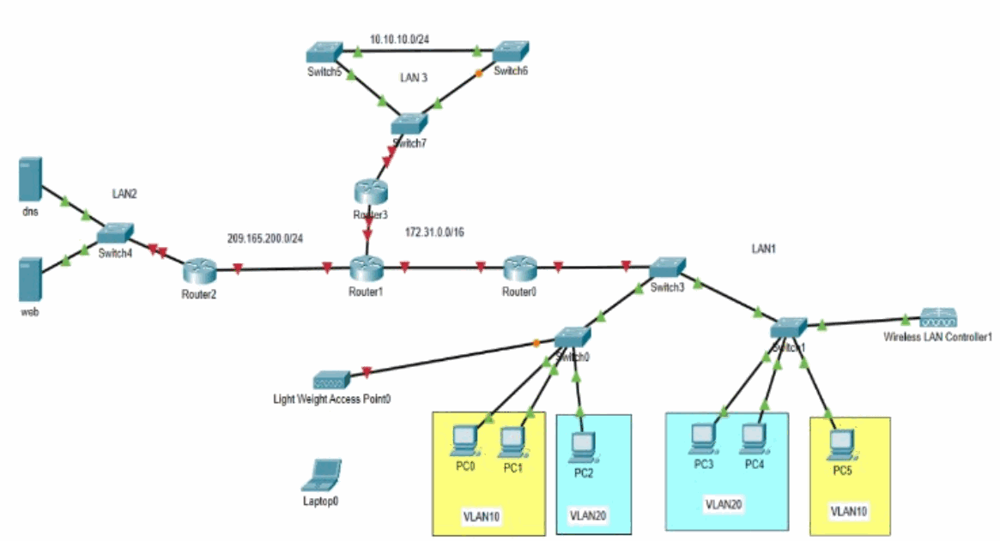

<p><sub><strong>Screenshot 001 - Complete Lab Topology:</strong> Original Packet Tracer topology showing the routed, switched, wireless, server, and client segments used in the project.</sub></p>

---------

## Device Identity and Management Foundation

Each network device receives a predictable hostname and a common baseline configuration. The baseline includes console behavior, an enable secret, an authorization banner, line access, disabled domain lookup, and synchronized logging.

Telnet appears in the initial source configuration as a learning step. It is later replaced with SSH-only VTY access because Telnet exposes credentials and commands in clear text.

> `service password-encryption` provides reversible Cisco Type 7 obfuscation for some stored passwords; it is not a strong password-protection mechanism. For production, use `enable secret`, unique administrator accounts, SSH-only management, centralized TACACS+ or RADIUS, and securely managed credentials.

**Implemented controls:**

- Assigned `SAM-*` hostnames to routers and switches.
- Applied console, VTY, enable-secret, banner, and logging settings.
- Disabled DNS lookup delays caused by unrecognized CLI input.

### Assign device hostnames

Hostnames identify the device in prompts, logs, SSH keys, and troubleshooting output. The naming pattern separates routers (`SAM-R*`) from switches (`SAM-S*`) and makes multi-device command captures readable.

> Consistent names reduce configuration mistakes when the same command sequence is repeated across many devices.

#### SAM-S0

The switch is assigned the `SAM-S0` hostname so it can be identified consistently in prompts, logs, and remote sessions.

```cisco
configure terminal
hostname SAM-S0
end
write memory
```

#### SAM-S1

The switch is assigned the `SAM-S1` hostname so it can be identified consistently in prompts, logs, and remote sessions.

```cisco
configure terminal
hostname SAM-S1
end
write memory
```

#### SAM-S3

The switch is assigned the `SAM-S3` hostname so it can be identified consistently in prompts, logs, and remote sessions.

```cisco
configure terminal
hostname SAM-S3
end
write memory
```

#### SAM-S4

The switch is assigned the `SAM-S4` hostname so it can be identified consistently in prompts, logs, and remote sessions.

```cisco
configure terminal
hostname SAM-S4
end
write memory
```

#### SAM-S5

The switch is assigned the `SAM-S5` hostname so it can be identified consistently in prompts, logs, and remote sessions.

```cisco
configure terminal
hostname SAM-S5
end
write memory
```

#### SAM-S6

The switch is assigned the `SAM-S6` hostname so it can be identified consistently in prompts, logs, and remote sessions.

```cisco
configure terminal
hostname SAM-S6
end
write memory
```

#### SAM-S7

The switch is assigned the `SAM-S7` hostname so it can be identified consistently in prompts, logs, and remote sessions.

```cisco
configure terminal
hostname SAM-S7
end
write memory
```

#### SAM-R0

The router is assigned the `SAM-R0` hostname so it can be identified consistently in prompts, logs, and remote sessions.

```cisco
configure terminal
hostname SAM-R0
end
write memory
```

#### SAM-R1

The router is assigned the `SAM-R1` hostname so it can be identified consistently in prompts, logs, and remote sessions.

```cisco
configure terminal
hostname SAM-R1
end
write memory
```

#### SAM-R2

The router is assigned the `SAM-R2` hostname so it can be identified consistently in prompts, logs, and remote sessions.

```cisco
configure terminal
hostname SAM-R2
end
write memory
```

#### SAM-R3

The router is assigned the `SAM-R3` hostname so it can be identified consistently in prompts, logs, and remote sessions.

```cisco
configure terminal
hostname SAM-R3
end
write memory
```

### Configure initial local access controls

Console and VTY lines receive the laboratory password, privileged access receives an enable secret, and the MOTD banner warns against unauthorized use. `exec-timeout 0 30` closes an unattended session after 30 seconds, reducing the risk of leaving administrative access open. `no ip domain-lookup` prevents the device from treating a mistyped command as a hostname and waiting for an unnecessary DNS lookup, while `logging synchronous` keeps system messages from interrupting command entry.

> The initial `transport input telnet` setting is retained as historical lab evidence. The SSH chapter later replaces it with encrypted management, which is the appropriate operational state.

```cisco
no ip domain-lookup
enable secret Sam1234
service password-encryption
banner motd $
****************************************
* Welcome to Cisco Device.             *
* Authorized Access Only.              *
* This device is the property of -     *
* Samuel Kim!                          *
* Unauthorized access is prohibited!! *
****************************************
$
line console 0
 logging synchronous
 exec-timeout 0 30
 password Samabcd
 login
 exit
line vty 0 4
 transport input telnet
 password Samabcd
 login
 exit
```

### Apply the baseline to the routers

The same baseline is applied to SAM-R0 through SAM-R3. Each router configuration is written separately and in device order so the complete implementation can be reviewed without reading commands from images.

> Repeated configuration should remain consistent, but each device still needs individual verification because a missing line on one router can interrupt remote administration or logging.

#### SAM-R0

This is the complete initial management baseline for router `SAM-R0`. Telnet is retained only at this stage of the lab and is replaced by SSH later.

```cisco
configure terminal
hostname SAM-R0
no ip domain-lookup
enable secret Sam1234
service password-encryption
banner motd $
****************************************
* Welcome to Cisco Device.             *
* Authorized Access Only.              *
* This device is the property of -     *
* Samuel Kim!                          *
* Unauthorized access is prohibited!! *
****************************************
$
line console 0
 logging synchronous
 exec-timeout 0 30
 password Samabcd
 login
 exit
line vty 0 4
 transport input telnet
 password Samabcd
 login
 exit
end
write memory
```

#### SAM-R1

This is the complete initial management baseline for router `SAM-R1`. Telnet is retained only at this stage of the lab and is replaced by SSH later.

```cisco
configure terminal
hostname SAM-R1
no ip domain-lookup
enable secret Sam1234
service password-encryption
banner motd $
****************************************
* Welcome to Cisco Device.             *
* Authorized Access Only.              *
* This device is the property of -     *
* Samuel Kim!                          *
* Unauthorized access is prohibited!! *
****************************************
$
line console 0
 logging synchronous
 exec-timeout 0 30
 password Samabcd
 login
 exit
line vty 0 4
 transport input telnet
 password Samabcd
 login
 exit
end
write memory
```

#### SAM-R2

This is the complete initial management baseline for router `SAM-R2`. Telnet is retained only at this stage of the lab and is replaced by SSH later.

```cisco
configure terminal
hostname SAM-R2
no ip domain-lookup
enable secret Sam1234
service password-encryption
banner motd $
****************************************
* Welcome to Cisco Device.             *
* Authorized Access Only.              *
* This device is the property of -     *
* Samuel Kim!                          *
* Unauthorized access is prohibited!! *
****************************************
$
line console 0
 logging synchronous
 exec-timeout 0 30
 password Samabcd
 login
 exit
line vty 0 4
 transport input telnet
 password Samabcd
 login
 exit
end
write memory
```

#### SAM-R3

This is the complete initial management baseline for router `SAM-R3`. Telnet is retained only at this stage of the lab and is replaced by SSH later.

```cisco
configure terminal
hostname SAM-R3
no ip domain-lookup
enable secret Sam1234
service password-encryption
banner motd $
****************************************
* Welcome to Cisco Device.             *
* Authorized Access Only.              *
* This device is the property of -     *
* Samuel Kim!                          *
* Unauthorized access is prohibited!! *
****************************************
$
line console 0
 logging synchronous
 exec-timeout 0 30
 password Samabcd
 login
 exit
line vty 0 4
 transport input telnet
 password Samabcd
 login
 exit
end
write memory
```

### Apply the baseline to the switches

SAM-S0, SAM-S1, and SAM-S3 through SAM-S7 receive the same management foundation. The resulting device prompts and saved configurations establish the starting state for VLAN, trunk, Port Security, and EtherChannel work.

> Switch management security is independent of data-plane forwarding. A switch can forward frames while still having incomplete or insecure administrative access.

#### SAM-S0

This is the complete initial management baseline for switch `SAM-S0`. Telnet is retained only at this stage of the lab and is replaced by SSH later.

```cisco
configure terminal
hostname SAM-S0
no ip domain-lookup
enable secret Sam1234
service password-encryption
banner motd $
****************************************
* Welcome to Cisco Device.             *
* Authorized Access Only.              *
* This device is the property of -     *
* Samuel Kim!                          *
* Unauthorized access is prohibited!! *
****************************************
$
line console 0
 logging synchronous
 exec-timeout 0 30
 password Samabcd
 login
 exit
line vty 0 4
 transport input telnet
 password Samabcd
 login
 exit
end
write memory
```

#### SAM-S1

This is the complete initial management baseline for switch `SAM-S1`. Telnet is retained only at this stage of the lab and is replaced by SSH later.

```cisco
configure terminal
hostname SAM-S1
no ip domain-lookup
enable secret Sam1234
service password-encryption
banner motd $
****************************************
* Welcome to Cisco Device.             *
* Authorized Access Only.              *
* This device is the property of -     *
* Samuel Kim!                          *
* Unauthorized access is prohibited!! *
****************************************
$
line console 0
 logging synchronous
 exec-timeout 0 30
 password Samabcd
 login
 exit
line vty 0 4
 transport input telnet
 password Samabcd
 login
 exit
end
write memory
```

#### SAM-S3

This is the complete initial management baseline for switch `SAM-S3`. Telnet is retained only at this stage of the lab and is replaced by SSH later.

```cisco
configure terminal
hostname SAM-S3
no ip domain-lookup
enable secret Sam1234
service password-encryption
banner motd $
****************************************
* Welcome to Cisco Device.             *
* Authorized Access Only.              *
* This device is the property of -     *
* Samuel Kim!                          *
* Unauthorized access is prohibited!! *
****************************************
$
line console 0
 logging synchronous
 exec-timeout 0 30
 password Samabcd
 login
 exit
line vty 0 4
 transport input telnet
 password Samabcd
 login
 exit
end
write memory
```

#### SAM-S4

This is the complete initial management baseline for switch `SAM-S4`. Telnet is retained only at this stage of the lab and is replaced by SSH later.

```cisco
configure terminal
hostname SAM-S4
no ip domain-lookup
enable secret Sam1234
service password-encryption
banner motd $
****************************************
* Welcome to Cisco Device.             *
* Authorized Access Only.              *
* This device is the property of -     *
* Samuel Kim!                          *
* Unauthorized access is prohibited!! *
****************************************
$
line console 0
 logging synchronous
 exec-timeout 0 30
 password Samabcd
 login
 exit
line vty 0 4
 transport input telnet
 password Samabcd
 login
 exit
end
write memory
```

#### SAM-S5

This is the complete initial management baseline for switch `SAM-S5`. Telnet is retained only at this stage of the lab and is replaced by SSH later.

```cisco
configure terminal
hostname SAM-S5
no ip domain-lookup
enable secret Sam1234
service password-encryption
banner motd $
****************************************
* Welcome to Cisco Device.             *
* Authorized Access Only.              *
* This device is the property of -     *
* Samuel Kim!                          *
* Unauthorized access is prohibited!! *
****************************************
$
line console 0
 logging synchronous
 exec-timeout 0 30
 password Samabcd
 login
 exit
line vty 0 4
 transport input telnet
 password Samabcd
 login
 exit
end
write memory
```

#### SAM-S6

This is the complete initial management baseline for switch `SAM-S6`. Telnet is retained only at this stage of the lab and is replaced by SSH later.

```cisco
configure terminal
hostname SAM-S6
no ip domain-lookup
enable secret Sam1234
service password-encryption
banner motd $
****************************************
* Welcome to Cisco Device.             *
* Authorized Access Only.              *
* This device is the property of -     *
* Samuel Kim!                          *
* Unauthorized access is prohibited!! *
****************************************
$
line console 0
 logging synchronous
 exec-timeout 0 30
 password Samabcd
 login
 exit
line vty 0 4
 transport input telnet
 password Samabcd
 login
 exit
end
write memory
```

#### SAM-S7

This is the complete initial management baseline for switch `SAM-S7`. Telnet is retained only at this stage of the lab and is replaced by SSH later.

```cisco
configure terminal
hostname SAM-S7
no ip domain-lookup
enable secret Sam1234
service password-encryption
banner motd $
****************************************
* Welcome to Cisco Device.             *
* Authorized Access Only.              *
* This device is the property of -     *
* Samuel Kim!                          *
* Unauthorized access is prohibited!! *
****************************************
$
line console 0
 logging synchronous
 exec-timeout 0 30
 password Samabcd
 login
 exit
line vty 0 4
 transport input telnet
 password Samabcd
 login
 exit
end
write memory
```

---------

## VLAN Segmentation and Trunk Hardening

VLAN 10 and VLAN 20 create separate Layer 2 broadcast domains for the user devices. Access ports place endpoints in the correct VLAN, while 802.1Q trunks carry both networks between switches and toward the router-on-a-stick gateway.

VLAN 99 is assigned as the native VLAN on the trunks and DTP negotiation is disabled. This removes reliance on the default native VLAN and prevents links from dynamically negotiating trunk mode.

> VLANs provide segmentation but do not independently enforce routed security. Inter-VLAN traffic is controlled later by router ACLs.

**Implemented controls:**

- Created and named VLAN 10 and VLAN 20.
- Assigned endpoint-facing interfaces as access ports.
- Configured static 802.1Q trunks with native VLAN 99 and `nonegotiate`.

### Create the user VLANs

The VLAN databases on SAM-S0, SAM-S1, and SAM-S3 are populated with VLAN 10 (`YELLOW`) and VLAN 20 (`BLUE`). Matching VLAN IDs are required on every switch that must transport those frames.

> A VLAN name is operational documentation; the numeric VLAN ID is the value carried in the 802.1Q tag.

#### SAM-S0

SAM-S0 creates both user VLANs before its access ports and trunks are assigned.

```cisco
configure terminal
vlan 10
 name YELLOW
vlan 20
 name BLUE
end
write memory
```

#### SAM-S1

SAM-S1 uses the same VLAN IDs and names so tagged traffic remains consistent across the switching path.

```cisco
configure terminal
vlan 10
 name YELLOW
vlan 20
 name BLUE
end
write memory
```

#### SAM-S3

SAM-S3 creates the same user VLANs before carrying them toward the router-on-a-stick gateway.

```cisco
configure terminal
vlan 10
 name YELLOW
vlan 20
 name BLUE
end
write memory
```

### Assign access ports to VLAN 10 and VLAN 20

Endpoint-facing FastEthernet ports are forced into access mode and assigned to their intended user VLAN. This prevents attached clients from negotiating a trunk and defines which broadcast domain each client joins.

> An incorrect access VLAN can place a client in the wrong IP subnet, bypass the intended ACL source classification, or prevent DHCP from reaching the correct pool.

#### SAM-S0

SAM-S0 places FastEthernet0/1-2 in VLAN 10 and FastEthernet0/5 in VLAN 20.

```cisco
configure terminal
interface range FastEthernet0/1 - 2
 switchport mode access
 switchport access vlan 10
 exit
interface FastEthernet0/5
 switchport mode access
 switchport access vlan 20
end
write memory
```

#### SAM-S1

SAM-S1 uses the opposite endpoint distribution: FastEthernet0/5 joins VLAN 10 and FastEthernet0/1-2 join VLAN 20.

```cisco
configure terminal
interface FastEthernet0/5
 switchport mode access
 switchport access vlan 10
 exit
interface range FastEthernet0/1 - 2
 switchport mode access
 switchport access vlan 20
end
write memory
```

### Configure and validate hardened trunks

The switch uplinks are placed in trunk mode, VLAN 99 is selected as the native VLAN, and DTP is disabled. `show interfaces trunk` then confirms 802.1Q status and native VLAN consistency across the participating switches.

> A native-VLAN mismatch can leak untagged traffic into the wrong VLAN and produce difficult Layer 2 troubleshooting symptoms.

#### SAM-S0

SAM-S0 creates native VLAN 99 and statically configures its uplinks as non-negotiating trunks.

```cisco
configure terminal
vlan 99
 name Native
interface FastEthernet0/3
 switchport mode trunk
 switchport trunk native vlan 99
 switchport nonegotiate
 exit
interface GigabitEthernet0/1
 switchport mode trunk
 switchport trunk native vlan 99
 switchport nonegotiate
end
write memory
```

#### SAM-S1

SAM-S1 applies the same native VLAN and static-trunk policy to both GigabitEthernet uplinks.

```cisco
configure terminal
vlan 99
 name Native
interface range GigabitEthernet0/1 - 2
 switchport mode trunk
 switchport trunk native vlan 99
 switchport nonegotiate
end
write memory
```

#### SAM-S3

SAM-S3 carries the user VLANs through FastEthernet0/24 and its GigabitEthernet uplinks.

```cisco
configure terminal
interface FastEthernet0/24
 switchport mode trunk
 switchport trunk native vlan 99
 switchport nonegotiate
 exit
interface range GigabitEthernet0/1 - 2
 switchport mode trunk
 switchport trunk native vlan 99
 switchport nonegotiate
end
write memory
```

#### Trunk validation

The `show interfaces trunk` output confirms 802.1Q operation and native VLAN 99 on every participating link.

```text
SAM-S0# show interfaces trunk
Port      Mode  Encapsulation  Status    Native vlan
Fa0/3     on    802.1q         trunking  99
Gi0/1     on    802.1q         trunking  99

SAM-S1# show interfaces trunk
Port      Mode  Encapsulation  Status    Native vlan
Gi0/1     on    802.1q         trunking  99
Gi0/2     on    802.1q         trunking  99

SAM-S3# show interfaces trunk
Port      Mode  Encapsulation  Status    Native vlan
Fa0/24    on    802.1q         trunking  99
Gi0/1     on    802.1q         trunking  99
Gi0/2     on    802.1q         trunking  99
```

---------

## DHCP and Router-on-a-Stick Routing

SAM-R0 acts as both the default gateway and DHCP server for VLAN 10 and VLAN 20. Two 802.1Q subinterfaces give the router one Layer 3 address in each VLAN, while separate DHCP pools assign clients the matching gateway and DNS server.

The switch port toward SAM-R0 is configured as a trunk so tagged frames from both user VLANs can reach the correct router subinterface.

> Router-on-a-stick is efficient for a lab and small environment, but all inter-VLAN traffic shares one physical router link. Larger designs commonly use multilayer switching for greater throughput and redundancy.

**Implemented controls:**

- Created DHCP pools for both user VLANs.
- Excluded the router interface addresses from dynamic allocation.
- Configured 802.1Q gateway subinterfaces and validated six client leases.

### Configure the DHCP pools and gateway subinterfaces

VLAN 10 uses `192.168.10.0/24` with gateway `192.168.10.1`, while VLAN 20 uses `192.168.20.0/24` with gateway `192.168.20.1`. Both pools distribute `172.19.0.100` as the DNS server.

> DHCP options must match the routed interface for the client VLAN. A lease can be assigned successfully while still producing unusable connectivity if the gateway or DNS option is incorrect.

#### SAM-R0

SAM-R0 creates one tagged gateway and one DHCP pool for each user VLAN. The gateway addresses are excluded so they cannot be leased to clients.

```cisco
configure terminal
interface GigabitEthernet0/0/0.10
 encapsulation dot1Q 10
 ip address 192.168.10.1 255.255.255.0
 exit
interface GigabitEthernet0/0/0.20
 encapsulation dot1Q 20
 ip address 192.168.20.1 255.255.255.0
 exit
ip dhcp pool VLAN10
 network 192.168.10.0 255.255.255.0
 default-router 192.168.10.1
 dns-server 172.19.0.100
 exit
ip dhcp excluded-address 192.168.10.1
ip dhcp pool VLAN20
 network 192.168.20.0 255.255.255.0
 default-router 192.168.20.1
 dns-server 172.19.0.100
 exit
ip dhcp excluded-address 192.168.20.1
end
write memory
```

### Connect the router through the switch trunk

SAM-S3 FastEthernet0/24 carries the tagged VLAN traffic to SAM-R0. The consolidated command captures show the trunk, subinterface, scope, gateway, DNS, and excluded-address settings together.

> The physical router interface remains shared, but each subinterface processes only frames carrying its configured 802.1Q VLAN tag.

#### SAM-S3

SAM-S3 FastEthernet0/24 is the static trunk toward SAM-R0, allowing both tagged user VLANs to reach their matching router subinterfaces.

```cisco
configure terminal
interface FastEthernet0/24
 switchport mode trunk
 switchport trunk native vlan 99
 switchport nonegotiate
end
write memory
```

### Validate client address allocation

PC0, PC1, and PC5 receive VLAN 10 addresses; PC2, PC3, and PC4 receive VLAN 20 addresses. Every lease shows the expected `/24` mask, local gateway, and DNS server.

> A DHCP lease validates scope delivery. Routing and policy behavior are verified separately with the later ping, SSH, and browser tests.


<p><sub><strong>Screenshot 002 - PC0 DHCP Lease:</strong> PC0 receives 192.168.10.2 with the VLAN 10 gateway and laboratory DNS server.</sub></p>


<p><sub><strong>Screenshot 003 - PC1 DHCP Lease:</strong> PC1 receives 192.168.10.3 from the VLAN 10 pool.</sub></p>

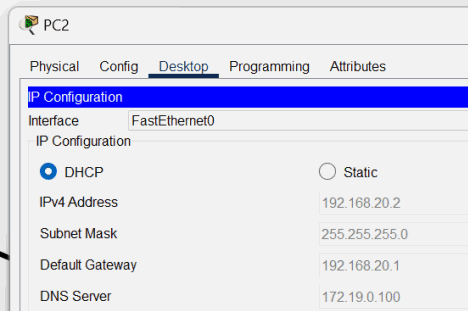

<p><sub><strong>Screenshot 004 - PC2 DHCP Lease:</strong> PC2 receives 192.168.20.2 from the VLAN 20 pool.</sub></p>


<p><sub><strong>Screenshot 005 - PC3 DHCP Lease:</strong> PC3 receives 192.168.20.3 from the VLAN 20 pool.</sub></p>


<p><sub><strong>Screenshot 006 - PC5 DHCP Lease:</strong> PC5 receives 192.168.10.4 from the VLAN 10 pool.</sub></p>


<p><sub><strong>Screenshot 007 - PC4 DHCP Lease:</strong> PC4 receives 192.168.20.4 from the VLAN 20 pool.</sub></p>

---------

## Server, DNS, and Wireless Services

LAN2 hosts the DNS and web servers on static addresses so clients and network services can depend on stable endpoints. DNS maps `www.sam.com` to the web server, while the wireless controller and lightweight access point extend VLAN 10 connectivity to a laptop.

The wireless workflow uses WPA2-Personal in the isolated lab and confirms that the laptop receives the same gateway and DNS information as wired VLAN 10 clients.

> A production wireless network should normally use WPA2/WPA3-Enterprise with centralized authentication, separate infrastructure management, and stronger key lifecycle controls than a shared PSK.

**Implemented controls:**

- Assigned static addressing to DNS and web services.
- Published the web server through an internal DNS A record.
- Built and validated the `SamNet` wireless client path.

### Configure static server addressing

The DNS server uses `172.19.0.100/16` and the web server uses `172.19.0.200/16`; both use `172.19.0.1` as their gateway. The web server points to the DNS server so the same resolver can be used for service testing.

> Static service addresses prevent a DNS record or logging destination from becoming stale after a lease change.

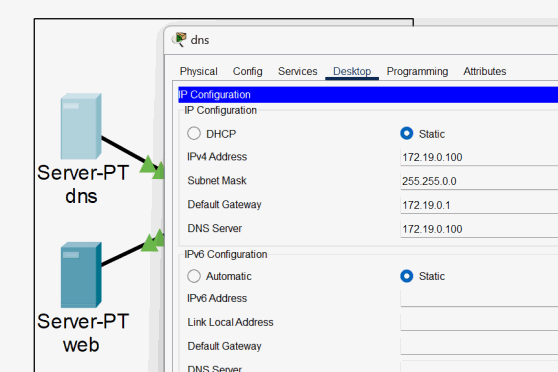

<p><sub><strong>Screenshot 008 - DNS Server Static Address:</strong> DNS server configured as 172.19.0.100/16 with gateway 172.19.0.1.</sub></p>


<p><sub><strong>Screenshot 009 - Web Server Static Address:</strong> Web server configured as 172.19.0.200/16 and pointed to the laboratory DNS server.</sub></p>

### Publish the internal web name

Packet Tracer DNS is enabled and an A record maps `www.sam.com` directly to `172.19.0.200`. An A record stores an IPv4 address; it is not a CNAME alias.

> DNS resolution proves name-to-address mapping. The browser tests later confirm that the HTTP service is reachable at the resolved address.


<p><sub><strong>Screenshot 010 - Web DNS A Record:</strong> A record maps www.sam.com to 172.19.0.200.</sub></p>

### Configure the WLAN profile and obtain a lease

The `SamNet` WLAN uses WPA2-Personal and places the wireless client in the VLAN 10 addressing domain. The laptop receives `192.168.10.5`, gateway `192.168.10.1`, and DNS server `172.19.0.100`.

> The controller profile defines wireless authentication and client forwarding; the wired trunk and DHCP configuration still determine whether the client can reach the routed network.


<p><sub><strong>Screenshot 011 - SamNet WLAN Profile:</strong> Wireless profile configured for SamNet with WPA2-Personal and the management setting shown in Packet Tracer.</sub></p>

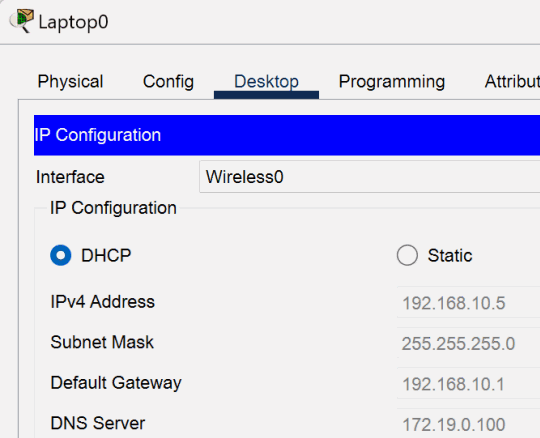

<p><sub><strong>Screenshot 012 - Wireless Client DHCP Lease:</strong> Laptop receives 192.168.10.5, the VLAN 10 gateway, and DNS settings over WLAN.</sub></p>

### Build and validate the wireless client path

FlexConnect options are enabled, a compatible wireless module is installed in the laptop, and the client discovers and joins SamNet through the lightweight access point. The access-point infrastructure address is excluded from the DHCP pool, and the switch links toward the access point and controller are configured as trunks.

> The visible pre-shared key is retained as laboratory data only. A real key must not be committed to a public repository.

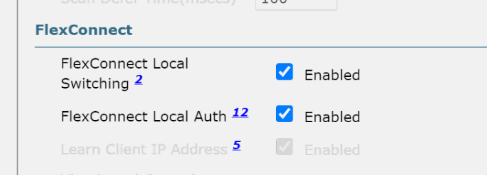

<p><sub><strong>Screenshot 013 - FlexConnect Settings:</strong> Local switching and local authentication enabled for the lightweight access-point workflow.</sub></p>


<p><sub><strong>Screenshot 014 - Laptop Wireless Module:</strong> Compatible wireless module installed in the Packet Tracer laptop.</sub></p>


<p><sub><strong>Screenshot 015 - Wireless Client and Access Point:</strong> Laptop associated through the lightweight access point.</sub></p>

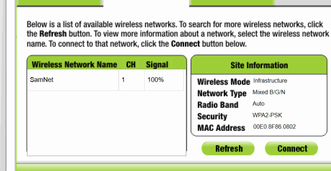

<p><sub><strong>Screenshot 016 - SamNet Discovery:</strong> Laptop detects the SamNet WLAN with WPA2-PSK security.</sub></p>


<p><sub><strong>Screenshot 017 - SamNet WPA2 Authentication:</strong> Laboratory pre-shared key entered to join the wireless network.</sub></p>

#### SAM-R0

The intended access-point address is excluded from DHCP so it remains available for infrastructure use.

```cisco
configure terminal
ip dhcp excluded-address 192.168.10.129
end
write memory
```

#### SAM-S0

SAM-S0 statically trunks the access-point connection and uses VLAN 99 as the native VLAN.

```cisco
configure terminal
interface FastEthernet0/3
 switchport mode trunk
 switchport trunk native vlan 99
 switchport nonegotiate
end
write memory
```

#### SAM-S1

SAM-S1 applies the matching trunk policy to the wireless-controller connection.

```cisco
configure terminal
interface GigabitEthernet0/2
 switchport mode trunk
 switchport trunk native vlan 99
 switchport nonegotiate
end
write memory
```

---------

## Access-Layer Port Security

SAM-S4 represents the server-room access switch. Unused interfaces are administratively disabled, and active access ports use sticky MAC learning with a one-address limit and restrict violation mode.

Restrict mode drops frames from unauthorized MAC addresses and increments the violation counter without shutting down the entire interface. This makes the violation observable while preserving access for the learned endpoint.

> Port Security limits attachment at one switch port; it does not authenticate a user and should complement 802.1X, physical security, and monitoring in production.

**Implemented controls:**

- Shut down unused access and uplink interfaces.
- Enabled one-address sticky Port Security on the used access ports.
- Recorded the configured restrict action and violation count.

### Disable unused interfaces and enable sticky learning

Unused SAM-S4 ports are shut down before the three active interfaces are placed in access mode and protected. Sticky learning stores the first observed source MAC as the permitted address for that port.

> An overly broad interface range can disable legitimate uplinks. Interface selections must be checked against the physical topology before applying a shutdown command.

#### SAM-S4

SAM-S4 shuts down unused interfaces and protects the three active access ports with sticky MAC learning, a one-address limit, and restrict violation mode.

```cisco
configure terminal
interface range FastEthernet0/3 - 24, GigabitEthernet0/2
 shutdown
 exit
interface range FastEthernet0/1 - 2, GigabitEthernet0/1
 switchport mode access
 switchport port-security
 switchport port-security maximum 1
 switchport port-security mac-address sticky
 switchport port-security violation restrict
end
write memory
```

The operational table records one learned address on each secured port and eight violations on FastEthernet0/2.

```text
SAM-S4# show port-security
Secure Port  MaxSecureAddr  CurrentAddr  SecurityViolation  Security Action
Fa0/1        1              1            0                  Restrict
Fa0/2        1              1            8                  Restrict
Gi0/1        1              1            0                  Restrict
```

### Review Port Security state and limitations

`show port-security` reports the protected interfaces, one learned address per interface, restrict mode, and a violation count of eight on one port. The retained ping uses `172.168.0.1`, which is outside the documented topology, so that timeout is not treated as proof of enforcement.

> The violation counter is the relevant control evidence. A generic timeout can also result from an incorrect address, missing route, or unavailable endpoint.

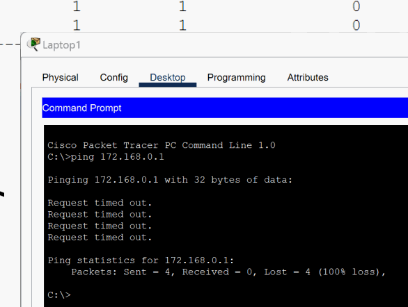

<p><sub><strong>Screenshot 018 - Initial Port Security Ping Test:</strong> The original test targets 172.168.0.1; this address is outside the documented topology and is retained as limited lab evidence.</sub></p>


<p><sub><strong>Screenshot 019 - Server Room Access Topology:</strong> Laptop and server connections shown around the protected SAM-S4 access switch.</sub></p>


<p><sub><strong>Screenshot 020 - Routed Core Topology:</strong> Transit networks between SAM-R0, SAM-R1, and SAM-R2 before OSPF activation.</sub></p>

---------

## OSPF Dynamic Routing

OSPF area 0 connects the user VLANs, routed transit links, server LAN, and later LAN3 networks. The routers advertise their directly connected prefixes and form FULL neighbor adjacencies over the transit segments.

The initial three-router design is expanded through the `192.168.13.0/24` link to SAM-R3, which also advertises `10.10.10.0/24`. This prepares the network for HSRP and the redundant LAN3 path.

> OSPF router IDs can appear as an address from another interface, so a neighbor ID does not have to match the connected-link address. Production OSPF should also use explicit passive interfaces and authentication where supported.

**Implemented controls:**

- Addressed the routed transit interfaces.
- Advertised all documented networks in OSPF area 0.
- Verified FULL adjacency and server-LAN reachability.

### Address the core transit links

The `172.31.0.0/16` and `209.165.200.0/24` networks connect SAM-R0, SAM-R1, and SAM-R2. Each side receives a unique address before OSPF is enabled.

> Dynamic routing cannot repair an incorrect connected-link mask. Both ends must agree on the subnet before a neighbor relationship can form.

#### SAM-R0

SAM-R0 addresses the transit link to SAM-R1 and advertises both user VLANs and the transit network in OSPF area 0.

```cisco
configure terminal
interface GigabitEthernet0/0/1
 ip address 172.31.0.1 255.255.0.0
 no shutdown
 exit
router ospf 1
 network 192.168.10.0 0.0.0.255 area 0
 network 192.168.20.0 0.0.0.255 area 0
 network 172.31.0.0 0.0.255.255 area 0
 passive-interface GigabitEthernet0/0/0
end
write memory
```

#### SAM-R1

SAM-R1 connects the two routed transit networks and advertises both in OSPF area 0.

```cisco
configure terminal
interface GigabitEthernet0/0/0
 ip address 172.31.0.2 255.255.0.0
 no shutdown
 exit
interface GigabitEthernet0/0/1
 ip address 209.165.200.1 255.255.255.0
 no shutdown
 exit
router ospf 1
 network 172.31.0.0 0.0.255.255 area 0
 network 209.165.200.0 0.0.0.255 area 0
end
write memory
```

#### SAM-R2

SAM-R2 addresses the link toward SAM-R1 and advertises that transit network together with the server LAN.

```cisco
configure terminal
interface GigabitEthernet0/0/0
 ip address 209.165.200.2 255.255.255.0
 no shutdown
 exit
router ospf 1
 network 209.165.200.0 0.0.0.255 area 0
 network 172.19.0.0 0.0.255.255 area 0
 passive-interface GigabitEthernet0/0/1
end
write memory
```

After the network statements are added, the routers report FULL OSPF adjacency and the server LAN becomes reachable through the routed path.

### Advertise the initial networks and validate adjacency

SAM-R0 advertises both user VLANs and the R0-R1 transit, SAM-R1 advertises both transit networks, and SAM-R2 advertises the R1-R2 transit and server LAN. FULL adjacency messages confirm neighbor formation, while the DNS-server ping confirms routed reachability after an initial timeout.

> The source uses `passive-interface g0/0/0` on a router with subinterfaces. In production, the exact user-facing subinterfaces should be made passive explicitly, or `passive-interface default` should be combined with selected `no passive-interface` transit links.


<p><sub><strong>Screenshot 021 - DNS Server Ping:</strong> Initial DNS-server ping receives three of four replies, demonstrating reachability after the first timeout.</sub></p>

### Extend OSPF to SAM-R3 and LAN3

SAM-R1 and SAM-R3 receive addresses in `192.168.13.0/24`, and SAM-R3 also receives `10.10.10.1/24` for LAN3. Both networks are then advertised in area 0; the incomplete first OSPF entry is retained as an intermediate command attempt followed by the completed syntax.

> Error output is useful evidence when the corrected command is shown immediately afterward. It demonstrates the final accepted syntax without hiding the troubleshooting path.


<p><sub><strong>Screenshot 022 - SAM-R1 to SAM-R3 Expansion:</strong> New 192.168.13.0/24 link and LAN3 path added to the routed topology.</sub></p>

#### SAM-R1

SAM-R1 adds the `192.168.13.0/24` link toward SAM-R3 and advertises it through OSPF.

```cisco
configure terminal
interface GigabitEthernet0/0/2
 ip address 192.168.13.1 255.255.255.0
 no shutdown
 exit
router ospf 1
 network 192.168.13.0 0.0.0.255 area 0
end
write memory
```

#### SAM-R3

SAM-R3 connects the new transit segment to LAN3 and advertises both networks in area 0.

```cisco
configure terminal
interface GigabitEthernet0/0/0
 ip address 192.168.13.2 255.255.255.0
 no shutdown
 exit
interface GigabitEthernet0/0/1
 ip address 10.10.10.1 255.255.255.0
 no shutdown
 exit
router ospf 1
 network 192.168.13.0 0.0.0.255 area 0
 network 10.10.10.0 0.0.0.255 area 0
 passive-interface GigabitEthernet0/0/1
end
write memory
```

---------

## SSH Management and Source ACLs

The management plane is migrated from Telnet to SSH version 2. RSA keys and a local user enable encrypted login, while the VTY lines accept only SSH and authenticate against the local username database.

An extended ACL on SAM-R0 then permits SSH sourced from VLAN 10 and denies SSH sourced from VLAN 20 while allowing other IP traffic. This separates management authorization from general network connectivity.

> The original devices use 1024-bit RSA keys, and two later devices use 2024-bit keys. These values are preserved as laboratory evidence; current production baselines should use a supported key size of at least 2048 bits and centralized AAA.

**Implemented controls:**

- Enabled SSH version 2 and local authentication.
- Replaced Telnet transport with SSH-only VTY access.
- Restricted SSH by source VLAN through ACL 101.

### Enable SSH and validate encrypted sessions

The devices generate RSA keys, create the local user `Sam`, and configure VTY lines with `transport input ssh` and `login local`. Successful client-to-router and router-to-router sessions show the authorization banner and target prompt.

> `ip domain-name SSH` satisfies the Packet Tracer key-generation prerequisite but is not a production DNS domain design. Real devices should use an organization-controlled domain name.

#### SAM-S7

`SAM-S7` receives a local laboratory administrator, RSA keys, SSH version 2, and SSH-only VTY transport.

```cisco
configure terminal
ip domain-name SSH
crypto key generate rsa
! Enter 1024 when IOS requests the modulus size.
username Sam secret Samabcd
line vty 0 4
 transport input ssh
 login local
 exit
ip ssh version 2
end
write memory
```


<p><sub><strong>Screenshot 023 - Router-to-Router SSH:</strong> SAM-R1 successfully opens an SSH session to SAM-R2 at 172.19.0.1.</sub></p>


<p><sub><strong>Screenshot 024 - Client-to-Router SSH:</strong> A Packet Tracer client successfully opens an SSH session to SAM-R1 at 209.165.200.1.</sub></p>

### Apply SSH to the complete device set

After the initial SAM-S7 example, the SSH sequence is applied individually to SAM-R0 through SAM-R3 and SAM-S0, SAM-S1, SAM-S3 through SAM-S6. The command blocks show that Telnet is replaced by SSH-only VTY transport on every device.

> Local accounts are practical for a lab but difficult to rotate consistently at scale. Centralized TACACS+ or RADIUS is preferable for production accountability and revocation.

#### SAM-R0

`SAM-R0` receives a local laboratory administrator, RSA keys, SSH version 2, and SSH-only VTY transport.

```cisco
configure terminal
ip domain-name SSH
crypto key generate rsa
! Enter 1024 when IOS requests the modulus size.
username Sam secret Samabcd
line vty 0 4
 transport input ssh
 login local
 exit
ip ssh version 2
end
write memory
```

#### SAM-R1

`SAM-R1` receives a local laboratory administrator, RSA keys, SSH version 2, and SSH-only VTY transport.

```cisco
configure terminal
ip domain-name SSH
crypto key generate rsa
! Enter 1024 when IOS requests the modulus size.
username Sam secret Samabcd
line vty 0 4
 transport input ssh
 login local
 exit
ip ssh version 2
end
write memory
```

#### SAM-R2

`SAM-R2` receives a local laboratory administrator, RSA keys, SSH version 2, and SSH-only VTY transport.

```cisco
configure terminal
ip domain-name SSH
crypto key generate rsa
! Enter 1024 when IOS requests the modulus size.
username Sam secret Samabcd
line vty 0 4
 transport input ssh
 login local
 exit
ip ssh version 2
end
write memory
```

#### SAM-R3

`SAM-R3` receives a local laboratory administrator, RSA keys, SSH version 2, and SSH-only VTY transport.

```cisco
configure terminal
ip domain-name SSH
crypto key generate rsa
! Enter 1024 when IOS requests the modulus size.
username Sam secret Samabcd
line vty 0 4
 transport input ssh
 login local
 exit
ip ssh version 2
end
write memory
```

#### SAM-S0

`SAM-S0` receives a local laboratory administrator, RSA keys, SSH version 2, and SSH-only VTY transport.

```cisco
configure terminal
ip domain-name SSH
crypto key generate rsa
! Enter 1024 when IOS requests the modulus size.
username Sam secret Samabcd
line vty 0 4
 transport input ssh
 login local
 exit
ip ssh version 2
end
write memory
```

#### SAM-S1

`SAM-S1` receives a local laboratory administrator, RSA keys, SSH version 2, and SSH-only VTY transport.

```cisco
configure terminal
ip domain-name SSH
crypto key generate rsa
! Enter 1024 when IOS requests the modulus size.
username Sam secret Samabcd
line vty 0 4
 transport input ssh
 login local
 exit
ip ssh version 2
end
write memory
```

#### SAM-S3

`SAM-S3` receives a local laboratory administrator, RSA keys, SSH version 2, and SSH-only VTY transport.

```cisco
configure terminal
ip domain-name SSH
crypto key generate rsa
! Enter 1024 when IOS requests the modulus size.
username Sam secret Samabcd
line vty 0 4
 transport input ssh
 login local
 exit
ip ssh version 2
end
write memory
```

#### SAM-S4

`SAM-S4` receives a local laboratory administrator, RSA keys, SSH version 2, and SSH-only VTY transport.

```cisco
configure terminal
ip domain-name SSH
crypto key generate rsa
! Enter 1024 when IOS requests the modulus size.
username Sam secret Samabcd
line vty 0 4
 transport input ssh
 login local
 exit
ip ssh version 2
end
write memory
```

#### SAM-S5

`SAM-S5` receives a local laboratory administrator, RSA keys, SSH version 2, and SSH-only VTY transport.

```cisco
configure terminal
ip domain-name SSH
crypto key generate rsa
! Enter 1024 when IOS requests the modulus size.
username Sam secret Samabcd
line vty 0 4
 transport input ssh
 login local
 exit
ip ssh version 2
end
write memory
```

#### SAM-S6

`SAM-S6` receives a local laboratory administrator, RSA keys, SSH version 2, and SSH-only VTY transport.

```cisco
configure terminal
ip domain-name SSH
crypto key generate rsa
! Enter 1024 when IOS requests the modulus size.
username Sam secret Samabcd
line vty 0 4
 transport input ssh
 login local
 exit
ip ssh version 2
end
write memory
```

### Restrict SSH by source subnet

ACL 101 denies TCP destination port 22 from `192.168.20.0/24`, permits it from `192.168.10.0/24`, and then permits all remaining IP traffic. The ACL is applied inbound on both router subinterfaces so the source policy is evaluated as traffic enters SAM-R0.

> The final `permit ip any any` means this ACL is an SSH-management filter, not a general firewall policy. PC0 succeeds from VLAN 10, while PC2 and PC3 time out from VLAN 20.

#### SAM-R0

ACL 101 allows SSH from VLAN 10, denies SSH from VLAN 20, and preserves all non-SSH IP traffic. It is applied inbound where each user VLAN enters the router.

```cisco
configure terminal
ip access-list extended 101
 deny tcp 192.168.20.0 0.0.0.255 any eq 22
 permit tcp 192.168.10.0 0.0.0.255 any eq 22
 permit ip any any
 exit
interface GigabitEthernet0/0/0.10
 ip access-group 101 in
 exit
interface GigabitEthernet0/0/0.20
 ip access-group 101 in
end
write memory
```


<p><sub><strong>Screenshot 025 - PC2 SSH Denied:</strong> VLAN 20 client cannot open SSH to the VLAN 10 router interface.</sub></p>


<p><sub><strong>Screenshot 026 - PC3 SSH Denied:</strong> Second VLAN 20 client receives a timeout when testing SSH access.</sub></p>


<p><sub><strong>Screenshot 027 - PC0 SSH Allowed:</strong> VLAN 10 client successfully authenticates to SAM-R0 over SSH.</sub></p>


<p><sub><strong>Screenshot 028 - SSH ACL Client Topology:</strong> VLAN 10 and VLAN 20 clients used for allowed and denied management tests.</sub></p>

---------

## Inter-VLAN Access Control

Two standard ACLs isolate VLAN 10 and VLAN 20 from each other while preserving access to other routed networks. Because a standard ACL matches only source IPv4 addresses, each list is placed outbound on the destination VLAN subinterface.

The tests show reciprocal blocking between the two user VLANs and continued reachability to local gateways and the LAN3 router address.

> Standard ACL placement matters: placing the same source-only rule too close to the source can unintentionally block that network from every destination.

**Implemented controls:**

- Blocked VLAN 10 sources from exiting toward VLAN 20.
- Blocked VLAN 20 sources from exiting toward VLAN 10.
- Preserved access to destinations outside the isolated VLAN pair.

### Map the segmentation test topology

The topology identifies the clients in both VLANs and the SAM-R0 subinterfaces where the outbound filters are applied.

> The ACLs operate at Layer 3; devices in the same VLAN still communicate through Layer 2 switching unless another control is introduced.


<p><sub><strong>Screenshot 029 - Inter-VLAN ACL Topology:</strong> Client VLANs and routed gateway used for the segmentation test.</sub></p>

### Apply reciprocal ACLs and validate behavior

ACL 20 denies the VLAN 10 source range before traffic leaves toward VLAN 20, and ACL 10 denies the VLAN 20 source range before traffic leaves toward VLAN 10. Destination-unreachable responses confirm the blocked paths, while successful pings confirm that unrelated routes remain available.

> The gateway-generated unreachable response demonstrates a routed policy decision more clearly than a silent timeout because it identifies the filtering router as the responding device.

#### SAM-R0

The two standard ACLs are placed outbound toward the destination VLANs. Each list blocks the opposite user subnet and permits every other source.

```cisco
configure terminal
ip access-list standard 20
 deny 192.168.10.0 0.0.0.255
 permit any
 exit
interface GigabitEthernet0/0/0.20
 ip access-group 20 out
 exit
ip access-list standard 10
 deny 192.168.20.0 0.0.0.255
 permit any
 exit
interface GigabitEthernet0/0/0.10
 ip access-group 10 out
end
write memory
```


<p><sub><strong>Screenshot 030 - VLAN 10 to VLAN 20 Blocked:</strong> PC0 receives destination-unreachable responses when pinging a VLAN 20 host.</sub></p>

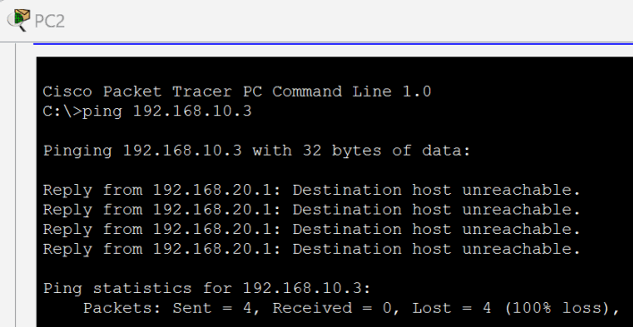

<p><sub><strong>Screenshot 031 - VLAN 20 to VLAN 10 Blocked:</strong> PC2 cannot ping a VLAN 10 host.</sub></p>

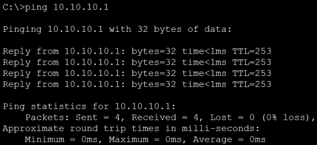

<p><sub><strong>Screenshot 032 - LAN3 Reachability Preserved:</strong> A permitted ping reaches 10.10.10.1 outside the blocked VLAN pair.</sub></p>

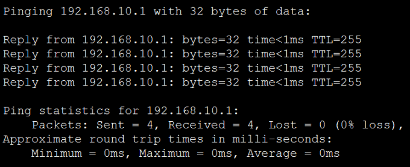

<p><sub><strong>Screenshot 033 - Gateway Reachability Preserved:</strong> VLAN 10 client retains reachability to its local default gateway.</sub></p>

---------

## PAT and Internal Web Validation

SAM-R2 demonstrates Port Address Translation between the `172.31.0.0/16` source network and the `172.19.0.0/16` server-facing segment. The router classifies matching inside sources and overloads them on the server-facing interface address.

The translation table proves the PAT behavior for `172.31.0.1`. Separate browser tests confirm that wired and wireless clients can resolve `www.sam.com` and reach the web server, but those `192.168.10.0/24` and `192.168.20.0/24` tests do not prove PAT because they do not match ACL 1.

> NAT is not an access-control substitute. Routing and ACLs decide whether a path is allowed; PAT only changes the addressing for traffic that matches its classification rule.

**Implemented controls:**

- Classified `172.31.0.0/16` for source translation.
- Configured PAT overload on SAM-R2.
- Validated the translation table and HTTP service reachability separately.

### Configure PAT on SAM-R2

GigabitEthernet0/0/0 is marked as the NAT inside interface and GigabitEthernet0/0/1 as outside for this laboratory direction. ACL 1 selects `172.31.0.0/16`, and the translation table maps the source to `172.19.0.1` while preserving unique ICMP identifiers.

> This is an internal source-NAT demonstration rather than an Internet edge deployment. The interface labels describe the configured translation direction, not a public/private trust classification.


<p><sub><strong>Screenshot 034 - PAT Lab Topology:</strong> R2 sits between the 209.165.200.0/24 transit and 172.19.0.0/16 server LAN.</sub></p>

#### SAM-R2

SAM-R2 marks the transit-facing interface as NAT inside, the server-facing interface as NAT outside, and overloads matching `172.31.0.0/16` sources on GigabitEthernet0/0/1.

```cisco
configure terminal
interface GigabitEthernet0/0/0
 ip nat inside
 exit
interface GigabitEthernet0/0/1
 ip nat outside
 exit
access-list 1 permit 172.31.0.0 0.0.255.255
ip nat inside source list 1 interface GigabitEthernet0/0/1 overload
end
write memory
```

The translation table shows unique ICMP identifiers for the translated source.

```text
SAM-R2# show ip nat translations
Pro   Inside global   Inside local    Outside local    Outside global
icmp  172.19.0.1:13   172.31.0.1:13   172.19.0.100:13  172.19.0.100:13
icmp  172.19.0.1:14   172.31.0.1:14   172.19.0.100:14  172.19.0.100:14
icmp  172.19.0.1:15   172.31.0.1:15   172.19.0.100:15  172.19.0.100:15
icmp  172.19.0.1:16   172.31.0.1:16   172.19.0.100:16  172.19.0.100:16
icmp  172.19.0.1:17   172.31.0.1:17   172.19.0.100:17  172.19.0.100:17
```

### Validate DNS and HTTP from every client

The wireless laptop and PCs in both user VLANs open `http://www.sam.com` and receive the Packet Tracer web page. These results validate DNS resolution, OSPF routing, ACL allowances for HTTP, and the web service itself.

> A browser result confirms application reachability. The PAT translation table remains the separate evidence for address translation.


<p><sub><strong>Screenshot 035 - Wireless Web Validation:</strong> Wireless laptop resolves www.sam.com and loads the Packet Tracer web service.</sub></p>


<p><sub><strong>Screenshot 036 - PC0 Web Validation:</strong> PC0 successfully opens www.sam.com.</sub></p>


<p><sub><strong>Screenshot 037 - PC1 Web Validation:</strong> PC1 successfully opens www.sam.com.</sub></p>


<p><sub><strong>Screenshot 038 - PC2 Web Validation:</strong> PC2 successfully opens www.sam.com.</sub></p>


<p><sub><strong>Screenshot 039 - PC3 Web Validation:</strong> PC3 successfully opens www.sam.com.</sub></p>


<p><sub><strong>Screenshot 040 - PC4 Web Validation:</strong> PC4 successfully opens www.sam.com.</sub></p>


<p><sub><strong>Screenshot 041 - PC5 Web Validation:</strong> PC5 successfully opens www.sam.com.</sub></p>

---------

## HSRP Gateway Redundancy

SAM-R4 and SAM-S8 extend the topology so SAM-R3 and SAM-R4 can share virtual gateways on `192.168.13.0/24` and `10.10.10.0/24`. OSPF advertises the additional router, and HSRP priorities make SAM-R3 active while SAM-R4 remains standby.

Clients use the virtual IP rather than either router's physical address. Preemption allows the preferred higher-priority router to reclaim the active role after it returns.

> The evidence validates HSRP roles and normal-path connectivity, but it does not show SAM-R3 being disabled and SAM-R4 becoming active. The project therefore documents configured redundancy without claiming a completed failover test.

**Implemented controls:**

- Added and secured SAM-R4 and SAM-S8.
- Advertised the redundant path through OSPF.
- Configured two HSRP groups with active and standby priorities.

### Add the redundant router and switch

The expanded topology introduces SAM-R4 as an alternate gateway and SAM-S8 as an additional switching component. Both receive the same management baseline and SSH-only administration used elsewhere in the lab.

> HSRP provides router gateway redundancy. It does not make a switch a standby device; Layer 2 path selection is handled separately by STP and EtherChannel.


<p><sub><strong>Screenshot 042 - Expanded HSRP Topology:</strong> Router4 and Switch8 added to provide an alternate routed path for the two shared LANs.</sub></p>

#### SAM-R4

This is the complete initial management baseline for router `SAM-R4`. Telnet is retained only at this stage of the lab and is replaced by SSH later.

```cisco
configure terminal
hostname SAM-R4
no ip domain-lookup
enable secret Sam1234
service password-encryption
banner motd $
****************************************
* Welcome to Cisco Device.             *
* Authorized Access Only.              *
* This device is the property of -     *
* Samuel Kim!                          *
* Unauthorized access is prohibited!! *
****************************************
$
line console 0
 logging synchronous
 exec-timeout 0 30
 password Samabcd
 login
 exit
line vty 0 4
 transport input telnet
 password Samabcd
 login
 exit
end
write memory
```

#### SAM-R4

`SAM-R4` receives a local laboratory administrator, RSA keys, SSH version 2, and SSH-only VTY transport.

```cisco
configure terminal
ip domain-name SSH
crypto key generate rsa
! Enter 2024 when IOS requests the modulus size.
username Sam secret Samabcd
line vty 0 4
 transport input ssh
 login local
 exit
ip ssh version 2
end
write memory
```

#### SAM-S8

This is the complete initial management baseline for switch `SAM-S8`. Telnet is retained only at this stage of the lab and is replaced by SSH later.

```cisco
configure terminal
hostname SAM-S8
no ip domain-lookup
enable secret Sam1234
service password-encryption
banner motd $
****************************************
* Welcome to Cisco Device.             *
* Authorized Access Only.              *
* This device is the property of -     *
* Samuel Kim!                          *
* Unauthorized access is prohibited!! *
****************************************
$
line console 0
 logging synchronous
 exec-timeout 0 30
 password Samabcd
 login
 exit
line vty 0 4
 transport input telnet
 password Samabcd
 login
 exit
end
write memory
```

#### SAM-S8

`SAM-S8` receives a local laboratory administrator, RSA keys, SSH version 2, and SSH-only VTY transport.

```cisco
configure terminal
ip domain-name SSH
crypto key generate rsa
! Enter 2024 when IOS requests the modulus size.
username Sam secret Samabcd
line vty 0 4
 transport input ssh
 login local
 exit
ip ssh version 2
end
write memory
```

### Address SAM-R4 and advertise its networks

SAM-R4 receives `10.10.10.2/24` on LAN3 and `192.168.13.3/24` on the transit network. OSPF area 0 advertises both networks, and a successful ping confirms reachability to the new router address.

> Routing must be operational before HSRP can provide useful end-to-end redundancy; a virtual gateway cannot compensate for a missing upstream route.

#### SAM-R4

SAM-R4 addresses both shared networks and advertises them in OSPF area 0 before HSRP is enabled.

```cisco
configure terminal
interface GigabitEthernet0/0/0
 ip address 10.10.10.2 255.255.255.0
 no shutdown
 exit
interface GigabitEthernet0/0/1
 ip address 192.168.13.3 255.255.255.0
 no shutdown
 exit
router ospf 1
 network 10.10.10.0 0.0.0.255 area 0
 network 192.168.13.0 0.0.0.255 area 0
 passive-interface GigabitEthernet0/0/0
end
write memory
```


<p><sub><strong>Screenshot 043 - SAM-R4 Ping Validation:</strong> PC0 successfully pings the new SAM-R4 transit address.</sub></p>

### Configure the HSRP virtual gateways

HSRP group 1 uses virtual IP `192.168.13.222`, and group 2 uses `10.10.10.222`. SAM-R3 has priority 150 and SAM-R4 priority 100, with preemption enabled on both routers.

> Production HSRP commonly tracks uplink or routing health. Without tracking, an active router can retain the gateway role even when a different upstream dependency fails.


<p><sub><strong>Screenshot 044 - HSRP Router Pair:</strong> SAM-R3 and SAM-R4 share virtual gateway addresses across both connected networks.</sub></p>

#### SAM-R3

SAM-R3 uses priority 150 and preemption, making it the preferred active gateway for both HSRP groups.

```cisco
configure terminal
interface GigabitEthernet0/0/0
 standby 1 ip 192.168.13.222
 standby 1 priority 150
 standby 1 preempt
 exit
interface GigabitEthernet0/0/1
 standby 2 ip 10.10.10.222
 standby 2 priority 150
 standby 2 preempt
end
write memory
```

#### SAM-R4

SAM-R4 uses priority 100 and remains the standby gateway while monitoring the same two virtual IP addresses.

```cisco
configure terminal
interface GigabitEthernet0/0/1
 standby 1 ip 192.168.13.222
 standby 1 priority 100
 standby 1 preempt
 exit
interface GigabitEthernet0/0/0
 standby 2 ip 10.10.10.222
 standby 2 priority 100
 standby 2 preempt
end
write memory
```

### Validate active and standby state

PC6 uses the LAN3 virtual IP as its default gateway. `show standby brief` identifies SAM-R3 as active and SAM-R4 as standby for both groups, while ping and traceroute demonstrate normal connectivity through the active path.

> These checks prove role election and current reachability. A complete failover validation would additionally shut down the active path and capture SAM-R4 taking the active role.


<p><sub><strong>Screenshot 045 - PC6 Virtual Gateway:</strong> PC6 uses 10.10.10.222 as its HSRP default gateway.</sub></p>

#### HSRP role verification

The operational output places SAM-R3 in the active role and SAM-R4 in the standby role for both virtual gateways.

```text
SAM-R4# show standby brief
Interface  Grp  Pri  P  State    Active        Standby  Virtual IP
Gi0/0/0    2    100  P  Standby  10.10.10.1    local    10.10.10.222
Gi0/0/1    1    100  P  Standby  192.168.13.2  local    192.168.13.222

SAM-R3# show standby brief
Interface  Grp  Pri  P  State   Active  Standby       Virtual IP
Gi0/0/0    1    150  P  Active  local   192.168.13.3  192.168.13.222
Gi0/0/1    2    150  P  Active  local   10.10.10.2    10.10.10.222
```


<p><sub><strong>Screenshot 046 - PC6 Routed Path Validation:</strong> PC6 ping and traceroute test normal routed connectivity through the active gateway.</sub></p>


<p><sub><strong>Screenshot 047 - PC4 Routed Path Validation:</strong> A second client validates normal connectivity across the HSRP-enabled topology.</sub></p>

---------

## STP and LACP EtherChannel

LAN3 receives redundant switching links between SAM-S5 and SAM-S7. LACP combines three physical FastEthernet links into one logical EtherChannel, while STP designates SAM-S7 as the root bridge for VLAN 1.

The design increases aggregate link capacity and gives STP a deterministic root for the Layer 2 topology. SAM-S6 and the additional trunks complete the alternate switching path.

> LACP treats the three matching physical links as one logical connection, while the STP root setting gives the redundant Layer 2 topology a predictable forwarding structure.

**Implemented controls:**

- Configured trunk links around LAN3.
- Created LACP channel-group 1 on SAM-S5 and SAM-S7.
- Set SAM-S7 as the VLAN 1 STP root primary.

### Configure the redundant Layer 2 path

SAM-S5 and SAM-S7 place FastEthernet0/21-22 and FastEthernet0/24 in channel-group 1 using LACP active mode. SAM-S7 is then configured as the preferred VLAN 1 root bridge.

> EtherChannel member interfaces must use matching speed, duplex, trunk, and VLAN settings. A mismatch can suspend a member or prevent the bundle from forming.

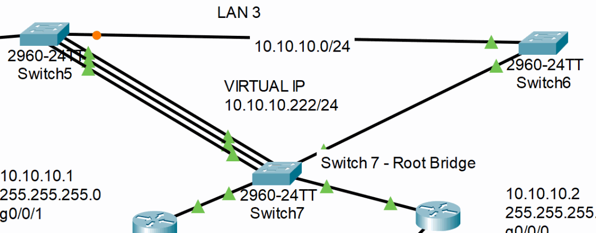

<p><sub><strong>Screenshot 048 - LAN3 Redundant Switching Topology:</strong> Switch7 is designated as STP root and linked to Switch5 through a multi-link EtherChannel.</sub></p>

#### SAM-S6

SAM-S6 configures GigabitEthernet0/1 and FastEthernet0/23 as static trunks within the redundant LAN3 switching path.

```cisco
configure terminal
interface range GigabitEthernet0/1, FastEthernet0/23
 switchport mode trunk
end
write memory
```

#### SAM-S5

SAM-S5 places FastEthernet0/21-22 and FastEthernet0/24 into LACP channel-group 1 and carries VLAN traffic over the logical bundle.

```cisco
configure terminal
interface FastEthernet0/23
 switchport mode trunk
 exit
interface range FastEthernet0/21 - 22, FastEthernet0/24
 channel-group 1 mode active
 switchport mode trunk
end
write memory
```

#### SAM-S7

SAM-S7 builds the matching LACP bundle and becomes the preferred STP root for VLAN 1.

```cisco
configure terminal
interface GigabitEthernet0/2
 switchport mode trunk
 exit
interface range FastEthernet0/21 - 22, FastEthernet0/24
 channel-group 1 mode active
 switchport mode trunk
 exit
spanning-tree vlan 1 root primary
end
write memory
```

---------

## Centralized Syslog Monitoring

The Packet Tracer web server also hosts the Syslog service for this laboratory. SAM-R2 enables millisecond log timestamps and sends messages to `172.19.0.200`, allowing configuration events to be viewed from one console.

The server receives messages from `172.19.0.1`, confirming the remote logging path. The displayed 1993 date reveals that the simulated devices are not synchronized to a reliable time source.

> Central logs lose investigative value when clocks disagree. Production devices and collectors should use authenticated NTP where available, consistent time zones, protected transport, and a dedicated retention policy.

**Implemented controls:**

- Enabled detailed timestamps on SAM-R2 logs.
- Defined the remote Syslog host.
- Verified event arrival on the Packet Tracer service.

### Send SAM-R2 events to the Syslog server

SAM-R2 confirms reachability to the server, enables `service timestamps log datetime msec`, and configures `logging host 172.19.0.200`. The Syslog service then lists the received configuration events.

> Co-locating web and logging services is acceptable in this isolated lab. Production monitoring should use a dedicated, hardened collector separated from the application server.

#### SAM-R2

SAM-R2 adds millisecond timestamps and forwards its log messages to the Packet Tracer Syslog service at `172.19.0.200`.

```cisco
configure terminal
service timestamps log datetime msec
logging host 172.19.0.200
end
write memory
```

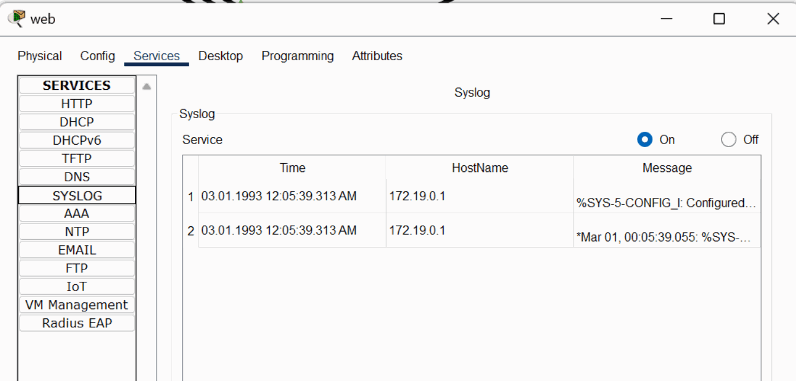

<p><sub><strong>Screenshot 049 - Syslog Server Events:</strong> Packet Tracer Syslog service receives SAM-R2 configuration events with the unsynchronized lab date.</sub></p>

---------

## Source-Restricted Switch Management

SAM-S4 receives a management SVI at `172.19.0.254/16` on VLAN 1 and uses `172.19.0.1` as its default gateway. The earlier SSH ACL on SAM-R0 permits management traffic from VLAN 10 and denies it from VLAN 20.

This is a source-subnet restriction, not a claim that the switch management SVI belongs to VLAN 10. The implemented SVI is VLAN 1.

> Production management should use a dedicated management VLAN or out-of-band network rather than VLAN 1, with AAA, least-privilege ACLs, logging, and restricted administrator workstations.

**Implemented controls:**

- Assigned a routed management address to SAM-S4.
- Configured the switch default gateway.
- Validated successful VLAN 10 SSH and denied VLAN 20 SSH.

### Configure the management SVI and gateway

SAM-S4 uses interface VLAN 1 with address `172.19.0.254/16` and gateway `172.19.0.1`. These settings make the Layer 2 switch reachable from remote routed networks.

> A Layer 2 switch needs an SVI address for management and an IP default gateway to return traffic to administrators outside the local subnet.

#### SAM-S4

SAM-S4 receives an SVI address for remote management and a default gateway for returning traffic to administrators outside the local subnet.

```cisco
configure terminal
interface vlan 1
 ip address 172.19.0.254 255.255.0.0
 no shutdown
 exit
ip default-gateway 172.19.0.1
end
write memory
```

### Validate allowed and denied SSH sources

PC0 in VLAN 10 successfully authenticates to `172.19.0.254`, while PC2 in VLAN 20 receives a timeout. The paired tests demonstrate that the source-based SSH restriction affects the intended management connection.

> Allowed and denied tests together provide stronger evidence than the ACL configuration alone because they show the observed client behavior on both sides of the policy.

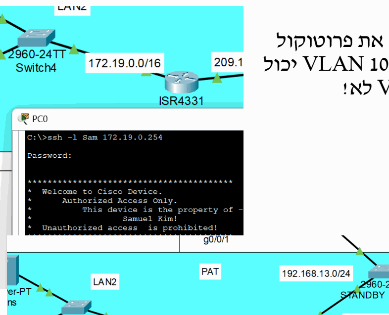

<p><sub><strong>Screenshot 050 - VLAN 10 Switch SSH Allowed:</strong> VLAN 10 client successfully opens an SSH session to 172.19.0.254.</sub></p>


<p><sub><strong>Screenshot 051 - VLAN 20 Switch SSH Denied:</strong> VLAN 20 client receives a timeout when attempting the same management connection.</sub></p>

## Testing and Verification

- Confirmed six wired DHCP leases and one wireless DHCP lease with the expected gateway and DNS values.
- Confirmed OSPF FULL adjacencies and routed access to the DNS/server LAN.
- Confirmed SSH succeeds from permitted VLAN 10 sources and is denied from VLAN 20.
- Confirmed reciprocal inter-VLAN ACL blocking while unrelated routed destinations remain reachable.
- Confirmed a PAT translation entry for traffic sourced from `172.31.0.0/16`.
- Confirmed all wired and wireless clients can resolve and open `www.sam.com`.
- Confirmed HSRP active and standby roles under normal operation; failover itself was not captured.
- Confirmed Syslog event delivery; the laboratory clock remains unsynchronized.
- Recorded Port Security violation state; the original ping to `172.168.0.1` is retained but not treated as validation.

## Results

The completed lab demonstrates how core CCNA routing and switching features work together in one environment. VLANs and router subinterfaces create the user segments, DHCP and DNS provide client services, OSPF carries routes between the sites, ACLs constrain management and inter-VLAN traffic, and PAT demonstrates source translation toward the server segment.

The later stages add encrypted management, access-port protection, HSRP gateway roles, STP root selection, LACP EtherChannel, and centralized event collection. Evidence limitations and production distinctions are documented in [`docs/notes.md`](docs/notes.md) instead of overstating what a configuration screen proves.

## Skills Demonstrated

- Cisco IOS device initialization and management-plane configuration
- VLAN creation, access-port assignment, 802.1Q trunks, and router-on-a-stick
- Router-based DHCP, static server addressing, DNS, and wireless integration
- OSPF single-area routing and route-expansion troubleshooting
- Standard and extended ACL design and validation
- SSH version 2, source-restricted management, and Port Security
- PAT, HSRP, STP root selection, and LACP EtherChannel
- Syslog configuration, evidence interpretation, and production-risk analysis

## Repository Structure

```text
cisco-packet-tracer-enterprise-network-lab/
|-- README.md
|-- LICENSE
|-- IMAGE_MANIFEST.md
|-- .gitattributes
|-- docs/
|   |-- commands.md
|   `-- notes.md
|-- configs/
|   `-- ccna-enterprise-network-lab.pkt
`-- images/
    |-- 01-network-topology/
    |-- 02-dhcp-router-on-a-stick/
    |-- 03-server-dns-wireless/
    |-- 04-port-security/
    |-- 05-ospf-routing/
    |-- 06-ssh-management/
    |-- 07-inter-vlan-acls/
    |-- 08-pat-and-web-validation/
    |-- 09-hsrp-redundancy/
    |-- 10-stp-etherchannel/
    |-- 11-syslog-monitoring/
    |-- 12-switch-management-acl/
    `-- 13-source-context/
```

## Notes

- Credentials shown in command blocks and screenshots are isolated Packet Tracer laboratory values and must not be reused.
- The Packet Tracer file is retained unchanged as the original configuration artifact.
- HSRP active and standby roles are demonstrated in the laboratory, with additional production recommendations documented in [`docs/notes.md`](docs/notes.md).
- The `/16` laboratory LANs, WPA2-Personal WLAN, VLAN 1 management SVI, Telnet history, and combined web/Syslog server should be redesigned before production use.
- The remaining non-CLI visual evidence is indexed in [IMAGE_MANIFEST.md](IMAGE_MANIFEST.md).

### Retained source context

The final contextual artwork from the source is preserved to keep the complete visual inventory, but it is not used as technical evidence.


<p><sub><strong>Screenshot 052 - Cisco Source Artwork:</strong> Contextual Cisco artwork retained from the source document.</sub></p>
