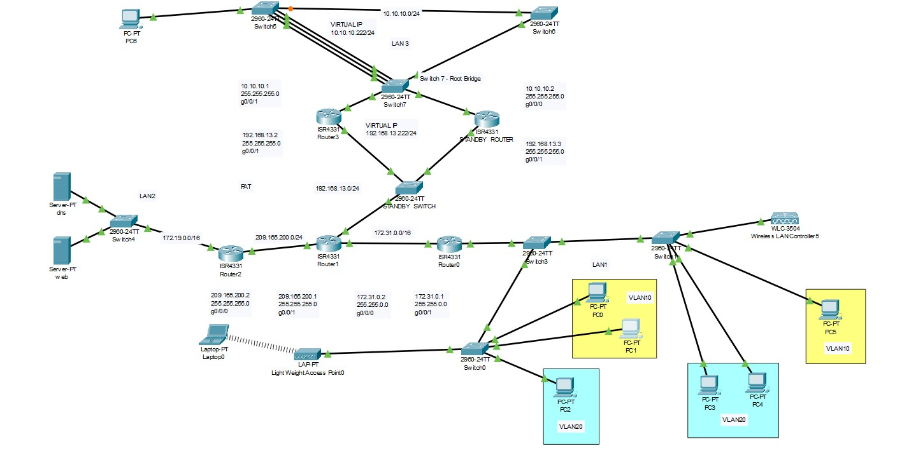

# Topology and Lab Environment

This chapter defines the Cisco Packet Tracer lab before the configuration chapters begin. The topology shows how the routed, switched, wireless, server, transit, and redundancy segments relate to each other, while the lab environment tables document the devices, subnets, and services used throughout the project.

## Topology

The network is organized into three operational areas. LAN1 contains the routed user VLANs and wireless infrastructure, LAN2 contains the DNS and internal web services, and LAN3 introduces the redundant gateway and switching path. Routed transit networks connect these areas and provide the foundation for OSPF routing, PAT, inter-VLAN access control, and end-to-end service validation.

Addressing is intentionally visible because DHCP scopes, ACL wildcard masks, PAT source classification, OSPF network advertisements, and HSRP virtual addresses all depend on consistent subnet boundaries. The topology gives the reader the map first, then the later chapters prove that routing, segmentation, security controls, and redundancy work as expected.

> A topology diagram establishes the intended design and traffic relationships. Command output, client tests, browser checks, and protocol state are used later to validate the actual operational behavior.

| Area | Purpose |
|------|---------|
| LAN1 | User VLANs, wireless access, router-on-a-stick gateways, DHCP, and client-side validation |
| LAN2 | Server network containing DNS and internal web services used for application reachability tests |
| LAN3 | Redundant gateway and switching area used for HSRP, STP, and EtherChannel validation |
| Transit links | Routed connectivity between routers and the OSPF path used to move traffic between network areas |
| Internet/PAT edge | Outside-facing path used to demonstrate address translation and outbound connectivity behavior |

<strong>Screenshot 001 - Complete Network Topology:</strong> Packet Tracer topology showing the routed, switched, wireless, server, client, transit, and redundancy segments used throughout the lab.

## Lab Environment

The lab uses Cisco Packet Tracer with ISR4331 routers, Catalyst 2960 switches, a wireless LAN controller, a lightweight access point, two servers, wired PCs, and a wireless laptop. The supplied Packet Tracer file is retained in [configs/ccna-enterprise-network-lab.pkt](../../configs/ccna-enterprise-network-lab.pkt) as the original lab artifact.

| Component | Description |
|-----------|-------------|
| Routers | `SAM-R0` through `SAM-R4`; inter-VLAN routing, OSPF, PAT, HSRP, DHCP, and routed transit links |
| Switches | `SAM-S0`, `SAM-S1`, `SAM-S3` through `SAM-S8`; access VLANs, trunks, Port Security, SSH, STP, and EtherChannel |
| VLAN 10 | `192.168.10.0/24`; gateway `192.168.10.1`; permitted administrative source network |
| VLAN 20 | `192.168.20.0/24`; gateway `192.168.20.1`; isolated from VLAN 10 and denied SSH management |
| R0-R1 transit | `172.31.0.0/16`; R0 `172.31.0.1`, R1 `172.31.0.2` |
| R1-R2 transit | `209.165.200.0/24`; R1 `209.165.200.1`, R2 `209.165.200.2` |
| Server LAN | `172.19.0.0/16`; gateway `172.19.0.1`, DNS `172.19.0.100`, web `172.19.0.200` |
| Redundancy transit | `192.168.13.0/24`; R1 `192.168.13.1`, R3 `192.168.13.2`, R4 `192.168.13.3`, HSRP VIP `192.168.13.222` |
| LAN3 | `10.10.10.0/24`; R3 `10.10.10.1`, R4 `10.10.10.2`, HSRP VIP `10.10.10.222` |
| Wireless | `SamNet` using WPA2-Personal; wireless clients join the VLAN 10 addressing domain |

> The usernames and passwords are intentionally shown openly because this is an isolated Packet Tracer lab and the visible values make the configuration reproducible for learning and review. They are not real credentials and must not be reused on production devices.

---

## Project Chapters

| # | Chapter | Description |
|---|---------|-------------|
| 0 | [Project Overview](../../README.md) | Main project overview, objectives, tools, and skills |
| 1 | [Topology and Lab Environment](README.md) | Topology, lab areas, devices, addressing, and traffic relationships |
| 2 | [Device Identity and Management Foundation](../02-device-identity-management/README.md) | Hostnames, local access, banners, console/VTY baseline, and device setup |
| 3 | [VLAN Segmentation and Trunk Hardening](../03-vlan-segmentation-trunking/README.md) | VLAN creation, access ports, trunk hardening, and trunk validation |
| 4 | [DHCP and Router-on-a-Stick Routing](../04-dhcp-router-on-a-stick/README.md) | Router subinterfaces, DHCP pools, switch trunk path, and client leases |
| 5 | [Server, DNS, and Wireless Services](../05-server-dns-wireless/README.md) | Static servers, DNS publishing, WLAN profile, WPA2 access, and wireless path validation |
| 6 | [Access-Layer Port Security](../06-port-security/README.md) | Unused-port shutdown, sticky MAC learning, violation mode, and validation limits |
| 7 | [OSPF Dynamic Routing](../07-ospf-routing/README.md) | Routed transit links, OSPF advertisements, adjacency validation, and LAN3 expansion |
| 8 | [SSH Management and Source ACLs](../08-ssh-management-acls/README.md) | SSH version 2 configuration, management access, and source-based ACL restriction |
| 9 | [Inter-VLAN Access Control](../09-inter-vlan-access-control/README.md) | Inter-VLAN isolation policy and validation of blocked and preserved reachability |
| 10 | [PAT and Internal Web Validation](../10-pat-web-validation/README.md) | PAT configuration on SAM-R2 and client DNS/HTTP validation |
| 11 | [HSRP Gateway Redundancy](../11-hsrp-redundancy/README.md) | Redundant gateway topology, HSRP active/standby roles, and validation limits |
| 12 | [STP and LACP EtherChannel](../12-stp-etherchannel/README.md) | STP root control, redundant switching, and LACP EtherChannel configuration |
| 13 | [Centralized Syslog Monitoring](../13-syslog-monitoring/README.md) | Centralized Syslog destination and event collection validation |
| 14 | [Source-Restricted Switch Management](../14-switch-management-acl/README.md) | Switch SVI management access and VLAN-based SSH allow/deny validation |
| 15 | [Final Summary](../15-final-summary/README.md) | Validation summary, production recommendations, skills, and project closure |
