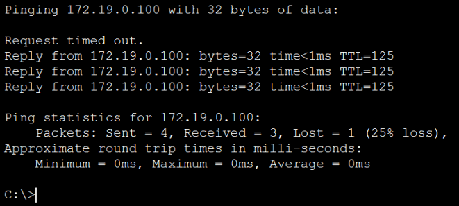
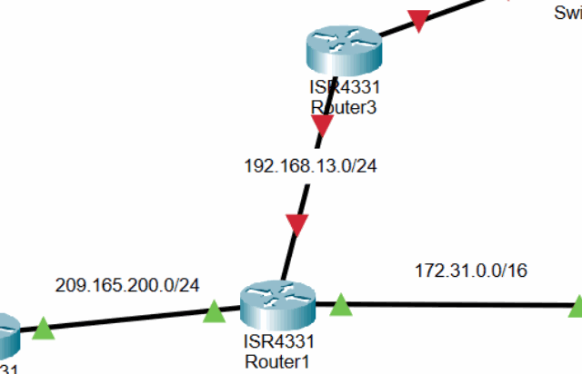

# OSPF Dynamic Routing

OSPF area 0 connects the user VLANs, routed transit links, server LAN, and later LAN3 networks. The routers advertise their directly connected prefixes and form FULL neighbor adjacencies over the transit segments.

The initial three-router design is expanded through the `192.168.13.0/24` link to SAM-R3, which also advertises `10.10.10.0/24`. This prepares the network for HSRP and the redundant LAN3 path.

> OSPF router IDs can appear as an address from another interface, so a neighbor ID does not have to match the connected-link address. Production OSPF should also use explicit passive interfaces and authentication where supported.

**Implemented controls:**

- Addressed the routed transit interfaces.
- Advertised all documented networks in OSPF area 0.
- Verified FULL adjacency and server-LAN reachability.

## Key Technical Terms

| Term | Meaning in this chapter |
|------|-------------------------|
| OSPF | A dynamic routing protocol that allows routers to learn network paths from each other. |
| Area 0 | The OSPF backbone area used by the lab to keep routing design simple. |
| Adjacency | A neighbor relationship between routers that exchange OSPF information. |
| Wildcard mask | The inverse-style mask used in Cisco OSPF network statements to match interfaces. |
| Passive interface | An interface advertised into OSPF without forming neighbor relationships on that segment. |

### Address the core transit links

The `172.31.0.0/16` and `209.165.200.0/24` networks connect SAM-R0, SAM-R1, and SAM-R2. Each side receives a unique address before OSPF is enabled.

> Dynamic routing cannot repair an incorrect connected-link mask. Both ends must agree on the subnet before a neighbor relationship can form.

#### SAM-R0

SAM-R0 addresses the transit link to SAM-R1 and advertises both user VLANs and the transit network in OSPF area 0.

```cisco
configure terminal
interface GigabitEthernet0/0/1
 ip address 172.31.0.1 255.255.0.0
 no shutdown
 exit
router ospf 1
 network 192.168.10.0 0.0.0.255 area 0
 network 192.168.20.0 0.0.0.255 area 0
 network 172.31.0.0 0.0.255.255 area 0
 passive-interface GigabitEthernet0/0/0
end
write memory
```

#### SAM-R1

SAM-R1 connects the two routed transit networks and advertises both in OSPF area 0.

```cisco
configure terminal
interface GigabitEthernet0/0/0
 ip address 172.31.0.2 255.255.0.0
 no shutdown
 exit
interface GigabitEthernet0/0/1
 ip address 209.165.200.1 255.255.255.0
 no shutdown
 exit
router ospf 1
 network 172.31.0.0 0.0.255.255 area 0
 network 209.165.200.0 0.0.0.255 area 0
end
write memory
```

#### SAM-R2

SAM-R2 addresses the link toward SAM-R1 and the server-facing LAN. The `172.19.0.1/16` address becomes the default gateway for the DNS, web, and Syslog services documented in the server chapter.

```cisco
configure terminal
interface GigabitEthernet0/0/0
 ip address 209.165.200.2 255.255.255.0
 no shutdown
 exit
interface GigabitEthernet0/0/1
 ip address 172.19.0.1 255.255.0.0
 no shutdown
 exit
router ospf 1
 network 209.165.200.0 0.0.0.255 area 0
 network 172.19.0.0 0.0.255.255 area 0
 passive-interface GigabitEthernet0/0/1
end
write memory
```

After the network statements are added, the routers report FULL OSPF adjacency and the server LAN becomes reachable through the routed path.

### Advertise the initial networks and validate adjacency

SAM-R0 advertises both user VLANs and the R0-R1 transit, SAM-R1 advertises both transit networks, and SAM-R2 advertises the R1-R2 transit and server LAN. FULL adjacency messages confirm neighbor formation, while the DNS-server ping confirms routed reachability after an initial timeout.

> The lab uses `passive-interface g0/0/0` on a router with subinterfaces. In production, the exact user-facing subinterfaces should be made passive explicitly, or `passive-interface default` should be combined with selected `no passive-interface` transit links.



<p><sub><strong>Screenshot 021 - DNS Server Ping:</strong> Initial DNS-server ping receives three of four replies, demonstrating reachability after the first timeout.</sub></p>

### Extend OSPF to SAM-R3 and LAN3

SAM-R1 and SAM-R3 receive addresses in `192.168.13.0/24`, and SAM-R3 also receives `10.10.10.1/24` for LAN3. Both networks are then advertised in area 0; the incomplete first OSPF entry is retained as an intermediate command attempt followed by the completed syntax.

> Error output is useful evidence when the corrected command is shown immediately afterward. It demonstrates the final accepted syntax without hiding the troubleshooting path.



<p><sub><strong>Screenshot 022 - SAM-R1 to SAM-R3 Expansion:</strong> New 192.168.13.0/24 link and LAN3 path added to the routed topology.</sub></p>

#### SAM-R1

SAM-R1 adds the `192.168.13.0/24` link toward SAM-R3 and advertises it through OSPF.

```cisco
configure terminal
interface GigabitEthernet0/0/2
 ip address 192.168.13.1 255.255.255.0
 no shutdown
 exit
router ospf 1
 network 192.168.13.0 0.0.0.255 area 0
end
write memory
```

#### SAM-R3

SAM-R3 connects the new transit segment to LAN3 and advertises both networks in area 0.

```cisco
configure terminal
interface GigabitEthernet0/0/0
 ip address 192.168.13.2 255.255.255.0
 no shutdown
 exit
interface GigabitEthernet0/0/1
 ip address 10.10.10.1 255.255.255.0
 no shutdown
 exit
router ospf 1
 network 192.168.13.0 0.0.0.255 area 0
 network 10.10.10.0 0.0.0.255 area 0
 passive-interface GigabitEthernet0/0/1
end
write memory
```

---------

---

## Project Chapters

| Chapter | Description |
|---------|-------------|
| [Project Overview](../../README.md) | Main project overview, topology, environment, objectives, and outcomes |
| [Device Identity and Management Foundation](../01-device-identity-management/README.md) | Hostnames, local access, banners, console/VTY baseline, and device setup |
| [VLAN Segmentation and Trunk Hardening](../02-vlan-segmentation-trunking/README.md) | VLAN creation, access ports, trunk hardening, and trunk validation |
| [DHCP and Router-on-a-Stick Routing](../03-dhcp-router-on-a-stick/README.md) | Router subinterfaces, DHCP pools, switch trunk path, and client leases |
| [Server, DNS, and Wireless Services](../04-server-dns-wireless/README.md) | Static servers, DNS publishing, WLAN profile, WPA2 access, and wireless path validation |
| [Access-Layer Port Security](../05-port-security/README.md) | Unused-port shutdown, sticky MAC learning, violation mode, and validation limits |
| [OSPF Dynamic Routing](../06-ospf-routing/README.md) | Routed transit links, OSPF advertisements, adjacency validation, and LAN3 expansion |
| [SSH Management and Source ACLs](../07-ssh-management-acls/README.md) | SSH version 2 configuration, management access, and source-based ACL restriction |
| [Inter-VLAN Access Control](../08-inter-vlan-access-control/README.md) | Inter-VLAN isolation policy and validation of blocked and preserved reachability |
| [PAT and Internal Web Validation](../09-pat-web-validation/README.md) | PAT configuration on SAM-R2 and client DNS/HTTP validation |
| [HSRP Gateway Redundancy](../10-hsrp-redundancy/README.md) | Redundant gateway topology, HSRP active/standby roles, and validation limits |
| [STP and LACP EtherChannel](../11-stp-etherchannel/README.md) | STP root control, redundant switching, and LACP EtherChannel configuration |
| [Centralized Syslog Monitoring](../12-syslog-monitoring/README.md) | Centralized Syslog destination and event collection validation |
| [Source-Restricted Switch Management](../13-switch-management-acl/README.md) | Switch SVI management access and VLAN-based SSH allow/deny validation |
| [Testing, Results, and Recommendations](../14-testing-results-summary/README.md) | Confirmed results, skills demonstrated, limitations, and production recommendations |
