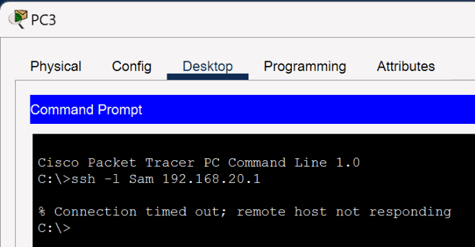

# SSH Management and Source ACLs

The management plane moves from Telnet to SSH version 2. RSA keys and a local user enable encrypted login, and VTY lines accept only SSH.

## Technical Context

An extended ACL on SAM-R0 permits SSH from VLAN 10, denies SSH from VLAN 20, and allows other IP traffic. This separates management authorization from general connectivity.

> Early SSH examples use 1024-bit RSA keys to match the original Packet Tracer task. Later devices use a stronger 2048-bit baseline with a production recommendation for centralized AAA.

**Implemented controls:**

- Enabled SSH version 2 and local authentication.
- Replaced Telnet transport with SSH-only VTY access.
- Restricted SSH by source VLAN through ACL 101.

## Key Technical Terms

| Term | Meaning in this chapter |
|------|-------------------------|
| SSH | Encrypted remote CLI access used to replace Telnet for management. |
| RSA key | The cryptographic key pair generated so the device can support SSH sessions. |
| Local user | A username and secret stored on the device for lab authentication. |
| Extended ACL | An access list that can match protocol, source, destination, and port. |
| Inbound ACL | A filter applied as packets enter an interface, which is where this lab checks SSH source networks. |

---

## Detailed Walkthrough

### Step 01 - Enable SSH and validate encrypted sessions

Devices generate RSA keys, create local user `Sam`, and set VTY lines to `transport input ssh` with `login local`. Successful sessions show the banner and target prompt.

> `ip domain-name SSH` satisfies the Packet Tracer key-generation prerequisite but is not a production DNS domain design. Real devices should use an organization-controlled domain name.

The SSH baseline is identical on the initial device set, so it is documented once and applied to the devices below.

| Device role | Devices receiving this SSH baseline |
|-------------|--------------------------------------|
| Routers | `SAM-R0`, `SAM-R1`, `SAM-R2`, `SAM-R3` |
| Switches | `SAM-S0`, `SAM-S1`, `SAM-S3`, `SAM-S4`, `SAM-S5`, `SAM-S6`, `SAM-S7` |

```cisco
configure terminal
ip domain-name SSH
crypto key generate rsa
! Enter 1024 when IOS requests the modulus size.
username Sam secret Samabcd
line vty 0 4
 transport input ssh
 login local
 exit
ip ssh version 2
end
write memory
```


<p><sub><strong>Screenshot 023 - Router-to-Router SSH:</strong> SAM-R1 successfully opens an SSH session to SAM-R2 at 172.19.0.1.</sub></p>


<p><sub><strong>Screenshot 024 - Client-to-Router SSH:</strong> A Packet Tracer client successfully opens an SSH session to SAM-R1 at 209.165.200.1.</sub></p>

---

### Step 02 - Restrict SSH by source subnet

ACL 101 denies SSH from `192.168.20.0/24`, permits SSH from `192.168.10.0/24`, and permits remaining IP traffic. It is applied inbound on both router subinterfaces.

> The final `permit ip any any` means this ACL is an SSH-management filter, not a general firewall policy. PC0 succeeds from VLAN 10, while PC2 and PC3 time out from VLAN 20.

#### SAM-R0

ACL 101 allows SSH from VLAN 10, denies SSH from VLAN 20, and preserves non-SSH traffic where each VLAN enters the router.

```cisco
configure terminal
ip access-list extended 101
 deny tcp 192.168.20.0 0.0.0.255 any eq 22
 permit tcp 192.168.10.0 0.0.0.255 any eq 22
 permit ip any any
 exit
interface GigabitEthernet0/0/0.10
 ip access-group 101 in
 exit
interface GigabitEthernet0/0/0.20
 ip access-group 101 in
end
write memory
```


<p><sub><strong>Screenshot 025 - PC2 SSH Denied:</strong> VLAN 20 client cannot open SSH to the VLAN 10 router interface.</sub></p>



<p><sub><strong>Screenshot 026 - PC3 SSH Denied:</strong> Second VLAN 20 client receives a timeout when testing SSH access.</sub></p>


<p><sub><strong>Screenshot 027 - PC0 SSH Allowed:</strong> VLAN 10 client successfully authenticates to SAM-R0 over SSH.</sub></p>


<p><sub><strong>Screenshot 028 - SSH ACL Client Topology:</strong> VLAN 10 and VLAN 20 clients used for allowed and denied management tests.</sub></p>

---

## Validation and Summary

Validation confirms successful SSH from permitted sources and denied SSH from VLAN 20. The ACL turns remote administration into an explicit management-plane policy.

---

## Project Chapters

| # | Chapter |
|---|---------|
| 0 | [Project Overview](../../README.md) |
| 1 | [Topology and Lab Environment](../01-topology-and-lab-environment/README.md) |
| 2 | [Device Identity and Management Foundation](../02-device-identity-management/README.md) |
| 3 | [VLAN Segmentation and Trunk Hardening](../03-vlan-segmentation-trunking/README.md) |
| 4 | [DHCP and Router-on-a-Stick Routing](../04-dhcp-router-on-a-stick/README.md) |
| 5 | [Server, DNS, and Wireless Services](../05-server-dns-wireless/README.md) |
| 6 | [Access-Layer Port Security](../06-port-security/README.md) |
| 7 | [OSPF Dynamic Routing](../07-ospf-routing/README.md) |
| 8 | [SSH Management and Source ACLs](../08-ssh-management-acls/README.md) |
| 9 | [Inter-VLAN Access Control](../09-inter-vlan-access-control/README.md) |
| 10 | [PAT and Internal Web Validation](../10-pat-web-validation/README.md) |
| 11 | [HSRP Gateway Redundancy](../11-hsrp-redundancy/README.md) |
| 12 | [STP and LACP EtherChannel](../12-stp-etherchannel/README.md) |
| 13 | [Centralized Syslog Monitoring](../13-syslog-monitoring/README.md) |
| 14 | [Source-Restricted Switch Management](../14-switch-management-acl/README.md) |
| 15 | [Final Summary](../15-final-summary/README.md) |
