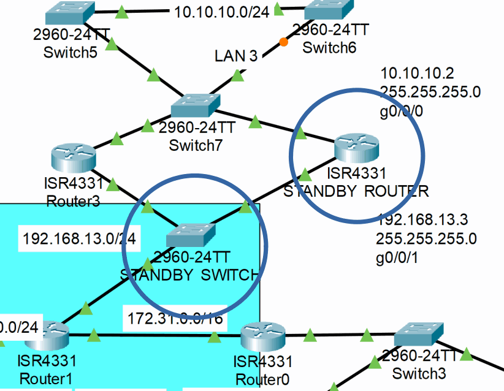
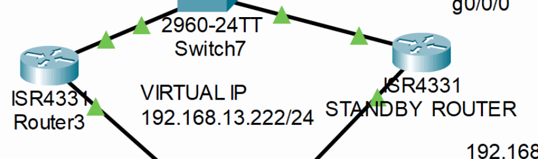
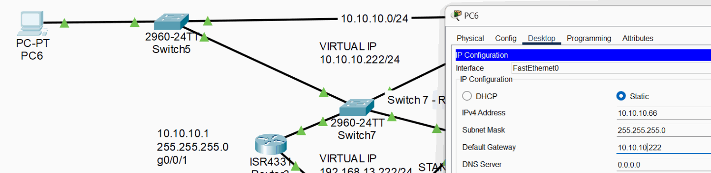

# HSRP Gateway Redundancy

SAM-R4 and SAM-S8 extend the topology so SAM-R3 and SAM-R4 can share virtual gateways on `192.168.13.0/24` and `10.10.10.0/24`. OSPF advertises the additional router, and HSRP priorities make SAM-R3 active while SAM-R4 remains standby.

Clients use the virtual IP rather than either router's physical address. Preemption allows the preferred higher-priority router to reclaim the active role after it returns.

> The captured outputs validate HSRP roles and normal-path connectivity, but they do not show SAM-R3 being disabled and SAM-R4 becoming active. The project therefore documents configured redundancy without claiming a completed failover test.

**Implemented controls:**

- Added and secured SAM-R4 and SAM-S8.
- Advertised the redundant path through OSPF.
- Configured two HSRP groups with active and standby priorities.

## Key Technical Terms

| Term | Meaning in this chapter |
|------|-------------------------|
| HSRP | Hot Standby Router Protocol, which lets routers share a virtual default gateway. |
| Virtual IP | The gateway address used by clients instead of a physical router interface. |
| Active router | The router currently forwarding traffic for the HSRP virtual gateway. |
| Standby router | The router waiting to take over if the active router fails. |
| Preemption | A setting that allows the preferred router to reclaim the active role after it returns. |

### Add the redundant router and switch

The expanded topology introduces SAM-R4 as an alternate gateway and SAM-S8 as an additional switching component. Both receive the same management baseline and SSH-only administration used elsewhere in the lab.

> HSRP provides router gateway redundancy. It does not make a switch a standby device; Layer 2 path selection is handled separately by STP and EtherChannel.



<p><sub><strong>Screenshot 042 - Expanded HSRP Topology:</strong> Router4 and Switch8 added to provide an alternate routed path for the two shared LANs.</sub></p>

#### SAM-R4

This is the complete initial management baseline for router `SAM-R4`. Telnet is retained only at this stage of the lab and is replaced by SSH later.

```cisco
configure terminal
hostname SAM-R4
no ip domain-lookup
enable secret Sam1234
service password-encryption
banner motd $
****************************************
* Welcome to Cisco Device.             *
* Authorized Access Only.              *
* This device is the property of -     *
* Samuel Kim!                          *
* Unauthorized access is prohibited!! *
****************************************
$
line console 0
 logging synchronous
 exec-timeout 0 30
 password Samabcd
 login
 exit
line vty 0 4
 transport input telnet
 password Samabcd
 login
 exit
end
write memory
```

#### SAM-R4

`SAM-R4` receives a local laboratory administrator, RSA keys, SSH version 2, and SSH-only VTY transport.

```cisco
configure terminal
ip domain-name SSH
crypto key generate rsa
! Enter 2048 when IOS requests the modulus size.
username Sam secret Samabcd
line vty 0 4
 transport input ssh
 login local
 exit
ip ssh version 2
end
write memory
```

#### SAM-S8

This is the complete initial management baseline for switch `SAM-S8`. Telnet is retained only at this stage of the lab and is replaced by SSH later.

```cisco
configure terminal
hostname SAM-S8
no ip domain-lookup
enable secret Sam1234
service password-encryption
banner motd $
****************************************
* Welcome to Cisco Device.             *
* Authorized Access Only.              *
* This device is the property of -     *
* Samuel Kim!                          *
* Unauthorized access is prohibited!! *
****************************************
$
line console 0
 logging synchronous
 exec-timeout 0 30
 password Samabcd
 login
 exit
line vty 0 4
 transport input telnet
 password Samabcd
 login
 exit
end
write memory
```

#### SAM-S8

`SAM-S8` receives a local laboratory administrator, RSA keys, SSH version 2, and SSH-only VTY transport.

```cisco
configure terminal
ip domain-name SSH
crypto key generate rsa
! Enter 2048 when IOS requests the modulus size.
username Sam secret Samabcd
line vty 0 4
 transport input ssh
 login local
 exit
ip ssh version 2
end
write memory
```

### Address SAM-R4 and advertise its networks

SAM-R4 receives `10.10.10.2/24` on LAN3 and `192.168.13.3/24` on the transit network. OSPF area 0 advertises both networks, and a successful ping confirms reachability to the new router address.

> Routing must be operational before HSRP can provide useful end-to-end redundancy; a virtual gateway cannot compensate for a missing upstream route.

#### SAM-R4

SAM-R4 addresses both shared networks and advertises them in OSPF area 0 before HSRP is enabled.

```cisco
configure terminal
interface GigabitEthernet0/0/0
 ip address 10.10.10.2 255.255.255.0
 no shutdown
 exit
interface GigabitEthernet0/0/1
 ip address 192.168.13.3 255.255.255.0
 no shutdown
 exit
router ospf 1
 network 10.10.10.0 0.0.0.255 area 0
 network 192.168.13.0 0.0.0.255 area 0
 passive-interface GigabitEthernet0/0/0
end
write memory
```


<p><sub><strong>Screenshot 043 - SAM-R4 Ping Validation:</strong> PC0 successfully pings the new SAM-R4 transit address.</sub></p>

### Configure the HSRP virtual gateways

HSRP group 1 uses virtual IP `192.168.13.222`, and group 2 uses `10.10.10.222`. SAM-R3 has priority 150 and SAM-R4 priority 100, with preemption enabled on both routers.

> Production HSRP commonly tracks uplink or routing health. Without tracking, an active router can retain the gateway role even when a different upstream dependency fails.



<p><sub><strong>Screenshot 044 - HSRP Router Pair:</strong> SAM-R3 and SAM-R4 share virtual gateway addresses across both connected networks.</sub></p>

#### SAM-R3

SAM-R3 uses priority 150 and preemption, making it the preferred active gateway for both HSRP groups.

```cisco
configure terminal
interface GigabitEthernet0/0/0
 standby 1 ip 192.168.13.222
 standby 1 priority 150
 standby 1 preempt
 exit
interface GigabitEthernet0/0/1
 standby 2 ip 10.10.10.222
 standby 2 priority 150
 standby 2 preempt
end
write memory
```

#### SAM-R4

SAM-R4 uses priority 100 and remains the standby gateway while monitoring the same two virtual IP addresses.

```cisco
configure terminal
interface GigabitEthernet0/0/1
 standby 1 ip 192.168.13.222
 standby 1 priority 100
 standby 1 preempt
 exit
interface GigabitEthernet0/0/0
 standby 2 ip 10.10.10.222
 standby 2 priority 100
 standby 2 preempt
end
write memory
```

### Validate active and standby state

PC6 uses the LAN3 virtual IP as its default gateway. `show standby brief` identifies SAM-R3 as active and SAM-R4 as standby for both groups, while ping and traceroute demonstrate normal connectivity through the active path.

> These checks prove role election and current reachability. A complete failover validation would additionally shut down the active path and capture SAM-R4 taking the active role.



<p><sub><strong>Screenshot 045 - PC6 Virtual Gateway:</strong> PC6 uses 10.10.10.222 as its HSRP default gateway.</sub></p>

#### HSRP role verification

The operational output places SAM-R3 in the active role and SAM-R4 in the standby role for both virtual gateways.

```text
SAM-R4# show standby brief
Interface  Grp  Pri  P  State    Active        Standby  Virtual IP
Gi0/0/0    2    100  P  Standby  10.10.10.1    local    10.10.10.222
Gi0/0/1    1    100  P  Standby  192.168.13.2  local    192.168.13.222

SAM-R3# show standby brief
Interface  Grp  Pri  P  State   Active  Standby       Virtual IP
Gi0/0/0    1    150  P  Active  local   192.168.13.3  192.168.13.222
Gi0/0/1    2    150  P  Active  local   10.10.10.2    10.10.10.222
```


<p><sub><strong>Screenshot 046 - PC6 Routed Path Validation:</strong> PC6 ping and traceroute test normal routed connectivity through the active gateway.</sub></p>


<p><sub><strong>Screenshot 047 - PC4 Routed Path Validation:</strong> A second client validates normal connectivity across the HSRP-enabled topology.</sub></p>

---------

---

## Project Chapters

| Chapter | Description |
|---------|-------------|
| [Project Overview](../../README.md) | Main project overview, topology, environment, objectives, and outcomes |
| [Device Identity and Management Foundation](../01-device-identity-management/README.md) | Hostnames, local access, banners, console/VTY baseline, and device setup |
| [VLAN Segmentation and Trunk Hardening](../02-vlan-segmentation-trunking/README.md) | VLAN creation, access ports, trunk hardening, and trunk validation |
| [DHCP and Router-on-a-Stick Routing](../03-dhcp-router-on-a-stick/README.md) | Router subinterfaces, DHCP pools, switch trunk path, and client leases |
| [Server, DNS, and Wireless Services](../04-server-dns-wireless/README.md) | Static servers, DNS publishing, WLAN profile, WPA2 access, and wireless path validation |
| [Access-Layer Port Security](../05-port-security/README.md) | Unused-port shutdown, sticky MAC learning, violation mode, and validation limits |
| [OSPF Dynamic Routing](../06-ospf-routing/README.md) | Routed transit links, OSPF advertisements, adjacency validation, and LAN3 expansion |
| [SSH Management and Source ACLs](../07-ssh-management-acls/README.md) | SSH version 2 configuration, management access, and source-based ACL restriction |
| [Inter-VLAN Access Control](../08-inter-vlan-access-control/README.md) | Inter-VLAN isolation policy and validation of blocked and preserved reachability |
| [PAT and Internal Web Validation](../09-pat-web-validation/README.md) | PAT configuration on SAM-R2 and client DNS/HTTP validation |
| [HSRP Gateway Redundancy](../10-hsrp-redundancy/README.md) | Redundant gateway topology, HSRP active/standby roles, and validation limits |
| [STP and LACP EtherChannel](../11-stp-etherchannel/README.md) | STP root control, redundant switching, and LACP EtherChannel configuration |
| [Centralized Syslog Monitoring](../12-syslog-monitoring/README.md) | Centralized Syslog destination and event collection validation |
| [Source-Restricted Switch Management](../13-switch-management-acl/README.md) | Switch SVI management access and VLAN-based SSH allow/deny validation |
| [Testing, Results, and Recommendations](../14-testing-results-summary/README.md) | Confirmed results, skills demonstrated, limitations, and production recommendations |
