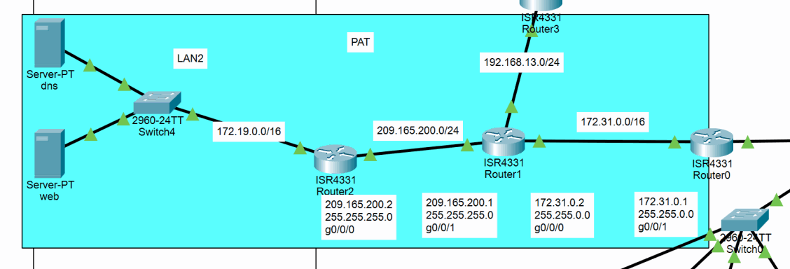
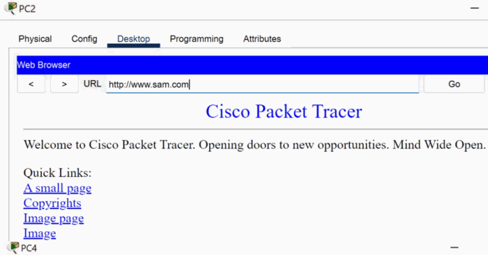
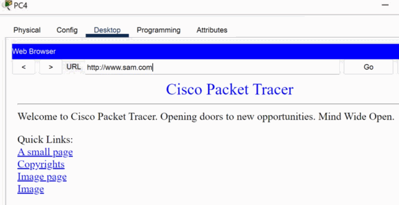

# PAT and Internal Web Validation

SAM-R2 demonstrates Port Address Translation between the `172.31.0.0/16` source network and the `172.19.0.0/16` server-facing segment. The router classifies matching inside sources and overloads them on the server-facing interface address.

## Technical Context

The translation table proves the PAT behavior for `172.31.0.1`. Separate browser tests confirm that wired and wireless clients can resolve `www.sam.com` and reach the web server, but those `192.168.10.0/24` and `192.168.20.0/24` tests do not prove PAT because they do not match ACL 1.

> NAT is not an access-control substitute. Routing and ACLs decide whether a path is allowed; PAT only changes the addressing for traffic that matches its classification rule.

**Implemented controls:**

- Classified `172.31.0.0/16` for source translation.
- Configured PAT overload on SAM-R2.
- Validated the translation table and HTTP service reachability separately.

## Key Technical Terms

| Term | Meaning in this chapter |
|------|-------------------------|
| NAT | Address translation that changes packet addressing as traffic crosses a boundary. |
| PAT | Port Address Translation, where many internal sessions share one translated address by using unique ports. |
| Inside / outside | Cisco NAT roles that identify where translated traffic originates and where it exits. |
| Translation table | Runtime evidence showing which internal address and port were translated. |
| HTTP validation | A browser-level test that proves DNS, routing, ACL permission, and web service availability together. |

---

## Detailed Walkthrough

### Step 01 - Configure PAT on SAM-R2

GigabitEthernet0/0/0 is marked as the NAT inside interface and GigabitEthernet0/0/1 as outside for this laboratory direction. ACL 1 selects `172.31.0.0/16`, and the translation table maps the source to `172.19.0.1` while preserving unique ICMP identifiers.

> This is an internal source-NAT demonstration rather than an Internet edge deployment. The interface labels describe the configured translation direction, not a public/private trust classification.



<p><sub><strong>Screenshot 034 - PAT Lab Topology:</strong> R2 sits between the 209.165.200.0/24 transit and 172.19.0.0/16 server LAN.</sub></p>

#### SAM-R2

SAM-R2 marks the transit-facing interface as NAT inside, the server-facing interface as NAT outside, and overloads matching `172.31.0.0/16` sources on GigabitEthernet0/0/1.

```cisco
configure terminal
interface GigabitEthernet0/0/0
 ip nat inside
 exit
interface GigabitEthernet0/0/1
 ip nat outside
 exit
access-list 1 permit 172.31.0.0 0.0.255.255
ip nat inside source list 1 interface GigabitEthernet0/0/1 overload
end
write memory
```

The translation table shows unique ICMP identifiers for the translated source.

```text
SAM-R2# show ip nat translations
Pro   Inside global   Inside local    Outside local    Outside global
icmp  172.19.0.1:13   172.31.0.1:13   172.19.0.100:13  172.19.0.100:13
icmp  172.19.0.1:14   172.31.0.1:14   172.19.0.100:14  172.19.0.100:14
icmp  172.19.0.1:15   172.31.0.1:15   172.19.0.100:15  172.19.0.100:15
icmp  172.19.0.1:16   172.31.0.1:16   172.19.0.100:16  172.19.0.100:16
icmp  172.19.0.1:17   172.31.0.1:17   172.19.0.100:17  172.19.0.100:17
```

---

### Step 02 - Validate DNS and HTTP from every client

The wireless laptop and PCs in both user VLANs open `http://www.sam.com` and receive the Packet Tracer web page. These results validate DNS resolution, OSPF routing, ACL allowances for HTTP, and the web service itself.

> A browser result confirms application reachability. The PAT translation table remains the separate evidence for address translation.


<p><sub><strong>Screenshot 035 - Wireless Web Validation:</strong> Wireless laptop resolves www.sam.com and loads the Packet Tracer web service.</sub></p>


<p><sub><strong>Screenshot 036 - PC0 Web Validation:</strong> PC0 successfully opens www.sam.com.</sub></p>


<p><sub><strong>Screenshot 037 - PC1 Web Validation:</strong> PC1 successfully opens www.sam.com.</sub></p>



<p><sub><strong>Screenshot 038 - PC2 Web Validation:</strong> PC2 successfully opens www.sam.com.</sub></p>


<p><sub><strong>Screenshot 039 - PC3 Web Validation:</strong> PC3 successfully opens www.sam.com.</sub></p>



<p><sub><strong>Screenshot 040 - PC4 Web Validation:</strong> PC4 successfully opens www.sam.com.</sub></p>


<p><sub><strong>Screenshot 041 - PC5 Web Validation:</strong> PC5 successfully opens www.sam.com.</sub></p>

---

## Validation and Summary

PAT is validated by the SAM-R2 translation table for `172.31.0.0/16`, while the browser screenshots validate DNS, routing, HTTP service availability, and permitted client access. The chapter keeps those two evidence types separate so the result is technically accurate.

---

## Project Chapters

| # | Chapter | Description |
|---|---------|-------------|
| 0 | [Project Overview](../../README.md) | Main project overview, objectives, tools, and skills |
| 1 | [Topology and Lab Environment](../01-topology-and-lab-environment/README.md) | Topology, lab areas, devices, addressing, and traffic relationships |
| 2 | [Device Identity and Management Foundation](../02-device-identity-management/README.md) | Hostnames, local access, banners, console/VTY baseline, and device setup |
| 3 | [VLAN Segmentation and Trunk Hardening](../03-vlan-segmentation-trunking/README.md) | VLAN creation, access ports, trunk hardening, and trunk validation |
| 4 | [DHCP and Router-on-a-Stick Routing](../04-dhcp-router-on-a-stick/README.md) | Router subinterfaces, DHCP pools, switch trunk path, and client leases |
| 5 | [Server, DNS, and Wireless Services](../05-server-dns-wireless/README.md) | Static servers, DNS publishing, WLAN profile, WPA2 access, and wireless path validation |
| 6 | [Access-Layer Port Security](../06-port-security/README.md) | Unused-port shutdown, sticky MAC learning, violation mode, and validation limits |
| 7 | [OSPF Dynamic Routing](../07-ospf-routing/README.md) | Routed transit links, OSPF advertisements, adjacency validation, and LAN3 expansion |
| 8 | [SSH Management and Source ACLs](../08-ssh-management-acls/README.md) | SSH version 2 configuration, management access, and source-based ACL restriction |
| 9 | [Inter-VLAN Access Control](../09-inter-vlan-access-control/README.md) | Inter-VLAN isolation policy and validation of blocked and preserved reachability |
| 10 | [PAT and Internal Web Validation](../10-pat-web-validation/README.md) | PAT configuration on SAM-R2 and client DNS/HTTP validation |
| 11 | [HSRP Gateway Redundancy](../11-hsrp-redundancy/README.md) | Redundant gateway topology, HSRP active/standby roles, and validation limits |
| 12 | [STP and LACP EtherChannel](../12-stp-etherchannel/README.md) | STP root control, redundant switching, and LACP EtherChannel configuration |
| 13 | [Centralized Syslog Monitoring](../13-syslog-monitoring/README.md) | Centralized Syslog destination and event collection validation |
| 14 | [Source-Restricted Switch Management](../14-switch-management-acl/README.md) | Switch SVI management access and VLAN-based SSH allow/deny validation |
| 15 | [Final Summary](../15-final-summary/README.md) | Validation summary, production recommendations, skills, and project closure |
